# SRS需求规格说明书

## 一、文档信息

| 项目名称 | 作品时光个人作品集系统 |
|---------|-----------|
| 文档版本 | V1.0 |
| 编制日期 | 2026-06-28 |
| 编制人 | - |
| 审核人 | - |
| 批准人 | - |
| 客户单位 | 个人 |
| 编制单位 | 个人 |
| 适用范围 | 个人作品集的内容管理与对外展示，覆盖作品、原型、拆解、成长轨迹与个人介绍的维护与浏览 |
| 核心目标 | 建设一套作品集系统，集中管理个人作品及迭代原型，对外展示专业能力与成长轨迹 |
| 文档状态 | 草稿 |

**历史版本**

| 版本 | 日期 | 作者 | 更改说明 |
|-----|------|------|---------|
| V1.0 | 2026-06-28 | - | 初始版本 |

---

## 二、项目概述

### 2.1 项目背景

随着个人职业发展和作品积累，分散的作品材料和迭代记录难以系统化对外呈现，面临以下挑战：

1. **作品材料分散**：作品描述、原型图、项目拆解内容分散存放，缺乏统一管理入口，更新和维护成本高。
2. **迭代过程难以体现**：原型在多轮迭代中产生多个版本，缺乏版本化的组织方式，无法直观展现设计演进过程。
3. **展示形式单一**：缺少面向访客的统一展示渠道，作品、成长轨迹与个人能力无法以结构化方式集中呈现。
4. **内容更新依赖改动源码**：展示内容若写死在前端，每次调整都需要改动代码，无法灵活维护。

为解决上述问题，建设作品时光个人作品集系统，实现作品内容的集中管理与对外结构化展示，提升个人作品的呈现质量与维护效率。

### 2.2 项目建设目标

本项目旨在建设一套作品集内容管理与展示系统，实现以下目标：

1. **作品集中管理**：统一维护作品的基本信息、富文本详情、封面与分类，支持发布与精选控制，作为对外展示的核心数据来源。
2. **原型版本化管理**：在作品下以版本方式组织原型，每个版本管理多张原型图片，完整呈现设计迭代过程，支持访客在展示端切换版本查看。
3. **项目拆解沉淀**：在作品下维护拆解文章，记录项目的思路与过程，丰富作品的内容深度。
4. **站点内容可配置**：将成长轨迹、个人介绍、首页展示内容纳入后台管理，内容调整无需改动源码。
5. **作品热度可见**：记录作品访问情况，统计作品访问量，为内容运营提供参考。

### 2.3 项目建设范围

本项目建设范围包括：

**系统端**：
- PC端管理后台（Web应用）：面向管理员的内容管理后台
- PC端展示站点（Web应用）：面向访客的作品集展示前端

**功能模块**：
- 作品管理：作品维护，含原型版本与拆解文章
- 分类管理：作品分类维护
- 时间轴管理：成长轨迹节点维护
- 关于我管理：个人介绍与技能维护
- 首页配置：展示文案与精选作品配置
- 数据统计：作品访问量统计
- 展示站点：首页、作品列表、作品详情、时间轴、关于我

**数据范围**：
- 作品数据：作品基本信息、富文本详情、原型版本与图片、拆解文章
- 站点内容数据：分类、时间轴节点、个人介绍、技能、首页配置
- 访问数据：作品访问量

**不包含的功能**：
- 多用户协作与角色权限分配：本期为单一管理员维护，不建设组织与角色权限体系
- 全站行为分析：本期仅统计作品访问量，不做全站行为埋点分析

### 2.4 业务流程图

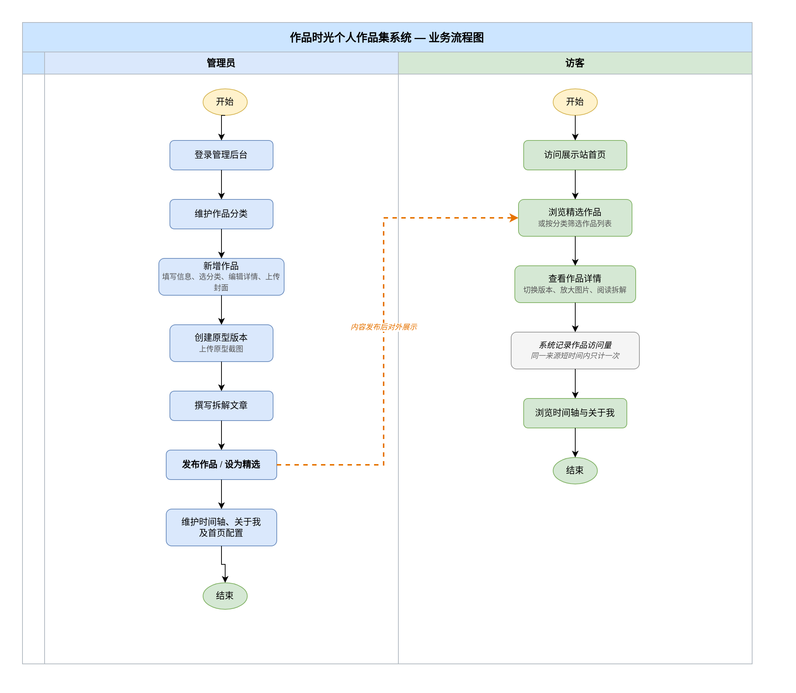

### 2.5 业务角色定义

| 角色名称 | 角色描述 | 主要职责 | 权限范围 |
|---------|---------|---------|---------|
| 管理员 | 作品集主人，负责后台内容维护 | 维护作品、原型、拆解、分类、时间轴、个人介绍、首页配置，查看访问统计 | 管理后台全部功能 |
| 访客 | 浏览展示站点的公众用户 | 浏览作品、原型、拆解、成长轨迹与个人介绍 | 展示站点公开内容的浏览权限 |

---

## 三、项目建设内容

### 3.1 总体功能架构

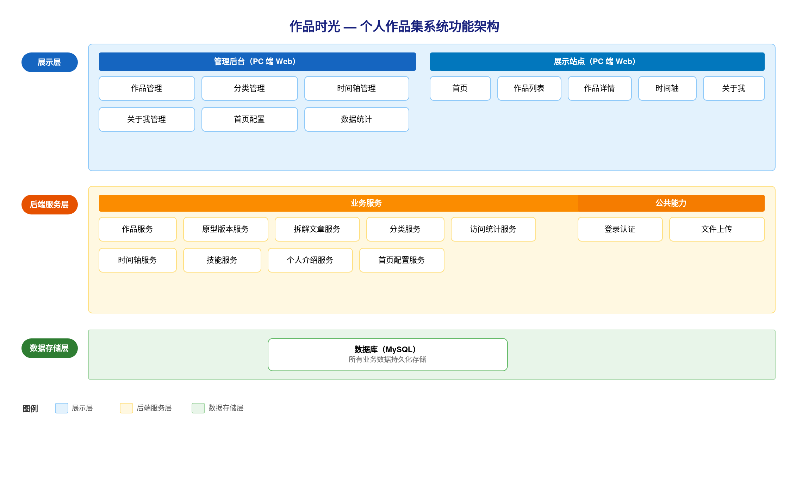

本系统包含管理后台与展示站点两个终端，均为 PC 端 Web 应用。管理后台供管理员维护内容，展示站点面向访客公开浏览。两端菜单结构分别说明如下：

**管理后台（PC 端）**

- 作品管理（一级菜单）
  - 作品列表（二级菜单）
  - 原型版本（二级菜单）
  - 拆解文章（二级菜单）
- 分类管理（一级菜单）
- 时间轴管理（一级菜单）
- 关于我管理（一级菜单）
- 首页配置（一级菜单）
- 数据统计（一级菜单）

**展示站点（PC 端）**

- 首页（一级菜单）
- 作品列表（一级菜单）
- 作品详情（一级菜单）
- 时间轴（一级菜单）
- 关于我（一级菜单）

说明：管理后台中，原型版本与拆解文章均隶属于具体作品，在作品列表中进入某个作品后进行维护，此处单列为菜单项以体现功能归属。

### 3.2 需求功能清单

| 序号 | 业务需求 | 需求概述 | 优先级 |
|-----|---------|---------|-------|
| 1 | 管理员身份认证 | 管理员通过账号密码登录管理后台，未登录不可进入内容管理功能 | P0 |
| 2 | 作品管理 | 维护作品基本信息、详情、封面与分类，支持发布与精选控制，作为对外展示的核心数据 | P0 |
| 3 | 原型版本管理 | 在作品下以版本方式组织原型并维护各版本图片，呈现设计迭代过程 | P0 |
| 4 | 拆解文章管理 | 在作品下维护项目拆解文章，记录作品的思路与过程 | P1 |
| 5 | 分类管理 | 维护作品分类，作为作品归属维度与展示端筛选项来源 | P0 |
| 6 | 时间轴管理 | 维护成长轨迹年份节点，对外展示职业发展路径 | P1 |
| 7 | 关于我管理 | 维护个人简介、技能与简历内容，对外展示个人能力 | P1 |
| 8 | 首页配置 | 维护展示站点首页展示文案与精选作品，控制首页呈现内容 | P1 |
| 9 | 作品访问统计 | 记录作品访问量并按访问量排行，反映作品受关注程度 | P2 |
| 10 | 作品集对外展示 | 访客浏览作品、原型、拆解、成长轨迹与个人介绍，无需登录 | P0 |

### 3.3 页面功能清单

| 终端 | 一级菜单 | 二级菜单 | 子功能 | 功能描述 |
|-----|---------|---------|-------|---------|
| 管理后台 | 作品管理 | 作品列表 | 筛选 | 按作品标题、所属分类、发布状态筛选作品 |
| ^ | ^ | ^ | 列表 | 分页展示作品，显示封面、标题、分类、状态、访问量 |
| ^ | ^ | ^ | 新增 | 填写作品标题、唯一标识、简介、分类，编辑详情内容，上传封面 |
| ^ | ^ | ^ | 编辑 | 修改作品已有信息 |
| ^ | ^ | ^ | 删除 | 删除作品及其原型版本与拆解文章 |
| ^ | ^ | ^ | 发布 | 将作品发布对外展示 |
| ^ | ^ | ^ | 下架 | 将作品改回草稿，不再对外展示 |
| ^ | ^ | ^ | 设为精选 | 标记作品为精选，用于首页展示 |
| ^ | ^ | 原型版本 | 新增版本 | 在作品下新增原型版本，填写版本名与标题 |
| ^ | ^ | ^ | 编辑版本 | 修改版本名、标题与排序 |
| ^ | ^ | ^ | 删除版本 | 删除原型版本及其图片 |
| ^ | ^ | ^ | 上传图片 | 在版本下上传多张原型图片并填写说明 |
| ^ | ^ | ^ | 排序图片 | 调整版本内图片展示顺序 |
| ^ | ^ | ^ | 删除图片 | 删除版本下指定图片 |
| ^ | ^ | 拆解文章 | 新增 | 在作品下新增拆解文章，填写标题与正文 |
| ^ | ^ | ^ | 编辑 | 修改拆解文章内容 |
| ^ | ^ | ^ | 删除 | 删除拆解文章 |
| ^ | ^ | ^ | 发布 | 将拆解文章发布对外展示 |
| ^ | ^ | ^ | 下架 | 将拆解文章改回草稿 |
| ^ | 分类管理 | - | 列表 | 展示全部分类，显示名称与关联作品数 |
| ^ | ^ | - | 新增 | 填写分类名称、唯一标识、排序 |
| ^ | ^ | - | 编辑 | 修改分类信息 |
| ^ | ^ | - | 删除 | 删除无作品引用的分类 |
| ^ | ^ | - | 排序 | 调整分类展示顺序 |
| ^ | 时间轴管理 | - | 列表 | 按年份展示成长轨迹节点 |
| ^ | ^ | - | 新增 | 填写年份、标题、描述 |
| ^ | ^ | - | 编辑 | 修改节点信息 |
| ^ | ^ | - | 删除 | 删除时间轴节点 |
| ^ | ^ | - | 排序 | 调整节点展示顺序 |
| ^ | 关于我管理 | - | 编辑个人介绍 | 维护个人简介、头像与简历内容 |
| ^ | ^ | - | 新增技能 | 填写技能名称与评分 |
| ^ | ^ | - | 编辑技能 | 修改技能信息 |
| ^ | ^ | - | 删除技能 | 删除指定技能 |
| ^ | ^ | - | 排序技能 | 调整技能展示顺序 |
| ^ | 首页配置 | - | 编辑展示文案 | 维护首页展示标语与副标题 |
| ^ | ^ | - | 选取精选作品 | 选择首页展示的精选作品 |
| ^ | 数据统计 | - | 访问量排行 | 按访问量查看作品排行 |
| 展示站点 | 首页 | - | 展示入口 | 查看展示标语与导航入口 |
| ^ | ^ | - | 精选作品 | 查看首页精选作品 |
| ^ | 作品列表 | - | 分类筛选 | 按分类筛选浏览作品 |
| ^ | ^ | - | 作品浏览 | 浏览作品封面、标题与简介 |
| ^ | 作品详情 | - | 详情查看 | 查看作品详情内容 |
| ^ | ^ | - | 原型版本切换 | 切换查看不同原型版本 |
| ^ | ^ | - | 图片放大 | 放大查看原型图片 |
| ^ | ^ | - | 拆解阅读 | 阅读作品拆解文章 |
| ^ | 时间轴 | - | 轨迹浏览 | 按年份浏览成长轨迹 |
| ^ | 关于我 | - | 能力查看 | 查看技能与个人介绍 |
| ^ | ^ | - | 简历查看 | 查看个人简历 |

### 3.4 页面访问权限

本系统采用单一管理员模式，管理后台全部功能对管理员开放；展示站点全部内容对访客公开浏览，无需登录。

| 功能模块 | 管理员 | 访客 |
|---------|-------|------|
| 作品管理（含原型版本、拆解文章） | 全部权限 | 无 |
| 分类管理 | 全部权限 | 无 |
| 时间轴管理 | 全部权限 | 无 |
| 关于我管理 | 全部权限 | 无 |
| 首页配置 | 全部权限 | 无 |
| 数据统计 | 全部权限 | 无 |
| 展示站点—首页 | 查看 | 查看 |
| 展示站点—作品列表 | 查看 | 查看 |
| 展示站点—作品详情 | 查看 | 查看 |
| 展示站点—时间轴 | 查看 | 查看 |
| 展示站点—关于我 | 查看 | 查看 |

说明：展示站点仅展示已发布的作品与拆解内容，草稿状态内容不对访客公开。

### 3.5 功能详细设计

### 3.5.1 作品管理

作品管理是系统的核心功能模块，管理员通过该模块维护所有作品的基本信息、原型版本及拆解文章。模块包含三个子功能：作品列表负责作品的全生命周期管理，原型版本维护每件作品的迭代版本及图片，拆解文章记录对作品的分析解读内容。所有数据均以作品为核心聚合，作品删除时级联清除其下全部原型版本与拆解文章。

#### 3.5.1.1 作品列表

**（一）功能需求概述**

作品列表是管理员维护作品集内容的主入口，支持对作品进行新增、编辑、删除、发布、下架及精选标记等全生命周期操作。管理员可通过筛选条件快速定位目标作品，已发布作品对访客公开，草稿状态仅后台可见。

**（二）功能设计**

**查询/筛选功能**

支持以下条件筛选，条件之间为"与"关系，触发查询后刷新列表：

| 筛选字段 | 类型 | 说明 |
|---------|------|------|
| 标题 | 文本输入 | 支持模糊搜索 |
| 所属分类 | 单选 | 来源于分类管理中已有的分类 |
| 发布状态 | 单选 | 枚举值：草稿 / 已发布 |

**列表功能**

列表展示所有作品记录，默认按排序值升序排列，排序值相同时按新增时间倒序：

| 列名 | 字段类型 | 说明 |
|-----|---------|------|
| 封面图 | 图片 | 无封面时显示占位图 |
| 标题 | 文本 | - |
| 唯一标识 | 文本 | - |
| 所属分类 | 文本 | - |
| 发布状态 | 状态 | 草稿 / 已发布 |
| 精选标记 | 状态 | 是 / 否 |
| 访问量 | 数字 | 只读，累计访客访问次数（已去重） |
| 排序值 | 数字 | 无值显示"-" |
| 发布时间 | 日期时间 | 首次发布时记录，未发布过显示"-" |
| 操作 | 操作 | 编辑、删除、发布/下架（按当前状态切换）、设为精选/取消精选（按当前标记切换） |

列表为空时显示："暂无作品数据"。

**新增功能**

点击"新增"进入新建作品页面。

| 字段名称 | 类型 | 长度限制 | 必填 | 默认值 | 说明 |
|---------|------|---------|------|-------|------|
| 标题 | 文本输入 | 最多100字 | 是 | - | - |
| 唯一标识 | 文本输入 | 最多100字符 | 是 | - | 仅允许英文字母、数字和连字符，全局唯一 |
| 简介 | 文本输入 | 最多500字 | 否 | - | - |
| 封面图 | 图片上传 | 1张 | 否 | - | 无封面时展示端显示占位图 |
| 富文本详情 | 富文本编辑 | - | 否 | - | 支持图文混排 |
| 所属分类 | 单选 | - | 是 | - | 来源于分类管理中已有的分类 |
| 精选标记 | 单选 | - | 否 | 否 | 是 / 否 |
| 发布状态 | 单选 | - | 否 | 草稿 | 草稿 / 已发布 |
| 排序值 | 数字输入 | 整数 | 否 | - | 越小越靠前，无值时排在有值记录之后 |

提交成功：返回作品列表，列表自动刷新。
提交失败：保留填写内容，显示具体错误原因。

**编辑功能**

点击"编辑"，自动填入当前作品数据，表单字段同新增。访问量与发布时间在编辑页中只读展示、仅供查看，不可编辑。
提交成功：返回作品列表，列表自动刷新。

**删除功能**

点击"删除"，弹出确认："删除作品将同时删除其原型版本与拆解文章，确认删除？"
确认后级联删除该作品下的全部原型版本、原型图片及拆解文章。
删除成功：列表自动刷新。

**发布 / 下架功能**

- 草稿状态作品点击"发布"，作品状态变更为已发布，操作按钮切换为"下架"。
- 已发布作品点击"下架"，作品状态变更为草稿，操作按钮切换为"发布"。

**设为精选 / 取消精选功能**

- 精选标记为"否"的作品点击"设为精选"，精选标记变更为"是"。
- 精选标记为"是"的作品点击"取消精选"，精选标记变更为"否"。

**业务规则**

- 唯一标识在系统内全局唯一。新增/编辑提交时若已存在相同唯一标识，阻止提交，提示："唯一标识已存在，请更换"。
- 唯一标识仅允许英文字母、数字和连字符。输入含其他字符时，阻止提交，提示："唯一标识仅允许英文字母、数字和连字符"。
- 所属分类为必填项。未选择时，阻止提交，提示："请选择所属分类"。
- 作品首次由草稿变更为已发布时，系统记录发布时间；后续再次发布不覆盖首次发布时间。
- 草稿状态的作品在展示端不公开，访客不可见；仅管理员在后台可见。
- 访问量由访客在展示端访问作品详情时累加，同一来源短时间内重复访问只计一次；管理员后台只读展示，不可手动修改。

**边界与异常**

- **空数据**：列表无作品时，显示"暂无作品数据"。
- **无封面**：封面图未上传时，列表与展示端均显示默认占位图。
- **唯一标识格式错误**：提交时含非法字符，提示"唯一标识仅允许英文字母、数字和连字符"。

**（三）业务逻辑关联**

- 所属分类数据来源于分类管理中已有的分类，需先在分类管理中完成分类配置后方可选择。
- 作品发布后，作为展示端作品列表与作品详情的数据来源；下架后从展示端移除。
- 精选标记为"是"的已发布作品，由首页配置模块引用作为精选作品展示。
- 作品删除后，其下全部原型版本、原型图片及拆解文章同步级联删除，展示端不再返回相关数据。
- 访问量由展示端访客访问触发累加，累加规则在展示端执行，后台仅作展示。

#### 3.5.1.2 原型版本

**（一）功能需求概述**

原型版本功能用于管理员维护每件作品的迭代设计版本及对应图片，支持在作品下新增多个版本（如 V1/V2/V3），每个版本下可上传多张原型图片并设置说明文字。展示端按版本和图片排序规则向访客呈现完整的设计演进过程。

**（二）功能设计**

**版本管理功能**

在作品详情内，管理员可对该作品的原型版本进行新增、编辑和删除。

| 字段名称 | 类型 | 长度限制 | 必填 | 默认值 | 说明 |
|---------|------|---------|------|-------|------|
| 版本名 | 文本输入 | 最多20字 | 是 | - | 如 V1、V2、V3 |
| 标题 | 文本输入 | 最多100字 | 否 | - | 版本简短说明 |
| 排序值 | 数字输入 | 整数 | 否 | - | 越小越靠前，无值时排在有值版本之后 |

新增版本提交成功：版本列表自动刷新。
编辑版本提交成功：当前版本信息自动更新。

**删除版本功能**

点击"删除版本"，弹出确认："删除版本将同时删除该版本下所有图片，确认删除？"
确认后级联删除该版本下的全部原型图片。
删除成功：版本列表自动刷新。

**图片管理功能**

在版本详情内，管理员可对该版本下的原型图片进行上传、编辑说明、排序和删除。

| 字段名称 | 类型 | 长度限制 | 必填 | 默认值 | 说明 |
|---------|------|---------|------|-------|------|
| 图片 | 图片上传 | - | 是 | - | 支持单张或批量上传 |
| 说明 | 文本输入 | 最多200字 | 否 | - | 对该图片的补充描述 |
| 排序值 | 数字输入 | 整数 | 否 | - | 越小越靠前，无值时排在有值图片之后 |

**业务规则**

- 版本名在同一作品下唯一。新增/编辑版本时若与该作品下已有版本名重复，阻止提交，提示"该版本名已存在，请更换"。
- 版本列表按排序值升序展示；排序值相同时按新增时间升序。展示端版本切换顺序依此规则。
- 图片列表按排序值升序展示；排序值相同时按上传时间升序。展示端图片展示顺序依此规则。
- 删除版本时，该版本下的全部原型图片同步级联删除，不可单独保留。

**边界与异常**

- **作品下无版本**：显示"暂无原型版本"。
- **版本下无图片**：显示"暂无图片"。

**（三）业务逻辑关联**

- 原型版本强依赖所属作品，作品不存在则版本不可独立存在；作品删除时版本及其下图片同步级联删除。
- 展示端通过作品标识获取该作品下的原型版本与图片，按排序值展示，供访客浏览设计迭代过程。

#### 3.5.1.3 拆解文章

**（一）功能需求概述**

拆解文章功能用于管理员在作品下新增对该作品的分析解读内容，以富文本形式呈现。每件作品可对应多篇拆解文章，已发布的文章对访客公开，草稿状态仅后台可见。

**（二）功能设计**

**新增功能**

在作品详情内，点击"新增"进入新建拆解文章页面。

| 字段名称 | 类型 | 长度限制 | 必填 | 默认值 | 说明 |
|---------|------|---------|------|-------|------|
| 标题 | 文本输入 | 最多100字 | 是 | - | - |
| 富文本正文 | 富文本编辑 | - | 否 | - | 支持图文混排 |
| 发布状态 | 单选 | - | 否 | 草稿 | 草稿 / 已发布 |
| 排序值 | 数字输入 | 整数 | 否 | - | 越小越靠前，无值时排在有值记录之后 |

提交成功：返回作品下拆解文章列表，列表自动刷新。
提交失败：保留填写内容，显示具体错误原因。

**编辑功能**

点击"编辑"，自动填入当前拆解文章数据，表单字段同新增。
提交成功：列表自动刷新。

**删除功能**

点击"删除"，弹出确认："确认删除该拆解文章？"
确认后删除该篇文章。删除成功：列表自动刷新。

**发布 / 下架功能**

- 草稿状态文章点击"发布"，文章状态变更为已发布，操作按钮切换为"下架"。
- 已发布文章点击"下架"，文章状态变更为草稿，操作按钮切换为"发布"。

**业务规则**

- 草稿状态的拆解文章在展示端不返回，访客不可见；仅管理员在后台可见。
- 拆解文章列表按排序值升序展示；排序值相同时按新增时间升序。展示端展示顺序依此规则。
- 所属作品删除时，该作品下的全部拆解文章同步级联删除。

**边界与异常**

- **作品下无拆解文章**：显示"暂无拆解文章"。

**（三）业务逻辑关联**

- 拆解文章强依赖所属作品，作品不存在则拆解文章不可独立存在；作品删除时全部拆解文章同步级联删除。
- 已发布的拆解文章作为展示端作品详情页拆解内容的数据来源，访客查看作品时可读取该作品下全部已发布的拆解文章。

**（四）用户操作流程图**

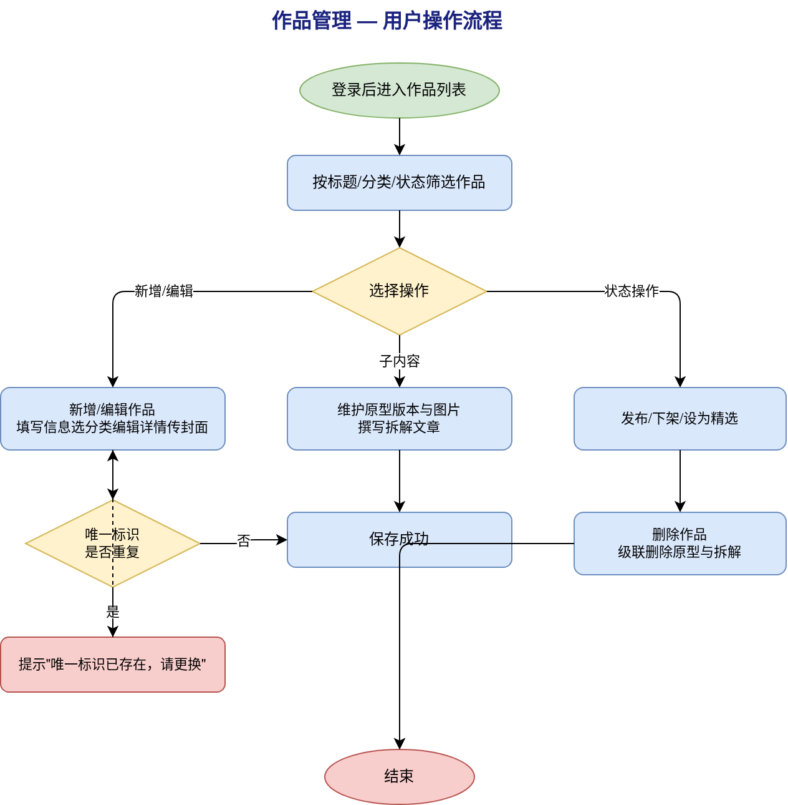

**（五）功能时序图**

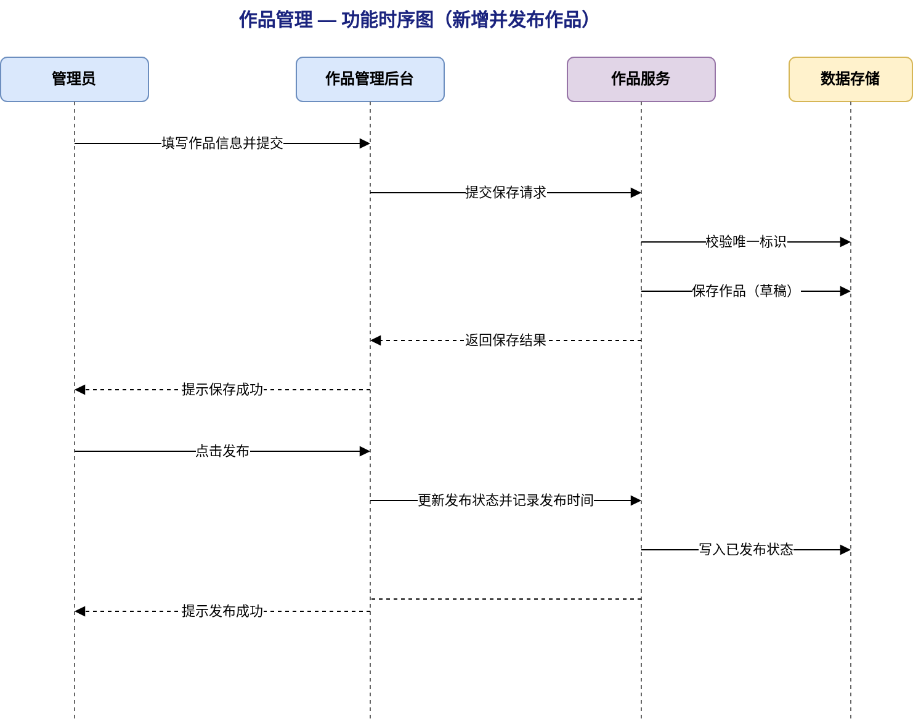

### 3.5.2 分类管理

**（一）功能需求概述**

分类管理功能用于维护作品的归属类别，管理员可对分类进行新增、编辑、删除与排序操作。分类是作品归属的基础数据，展示端作品列表的分类筛选项直接取自此处的配置结果，排序变更实时影响展示端筛选项的呈现顺序。

**（二）功能设计**

**筛选功能**

支持按分类名称进行模糊搜索，输入关键词后触发查询，结果在列表中实时刷新。

| 筛选字段 | 类型 | 说明 |
|---------|------|------|
| 分类名称 | 文本输入 | 支持模糊搜索 |

**列表功能**

列表展示系统内全部分类记录，按排序值升序排列。

| 列名 | 字段类型 | 说明 |
|-----|---------|------|
| 分类名 | 文本 | - |
| 唯一标识 | 文本 | - |
| 排序值 | 数字 | 数值越小排列越靠前 |
| 关联作品数 | 数字 | 只读统计值，统计范围含草稿与已发布的全部作品 |
| 操作 | 操作按钮 | 编辑、删除 |

列表为空时显示：暂无分类数据。

**新增功能**

点击"新增"弹出编辑窗口，填写完成后提交。

| 字段名称 | 类型 | 长度限制 | 必填 | 默认值 | 说明 |
|---------|------|---------|------|-------|------|
| 分类名 | 文本输入 | 1-50字 | 是 | - | 全局唯一 |
| 唯一标识 | 文本输入 | 1-100字符 | 是 | - | 全局唯一，仅允许英文字母、数字、连字符 |
| 排序值 | 整数输入 | - | 是 | - | 数值越小排列越靠前 |

提交成功：提示"保存成功"，窗口关闭，列表刷新，新增分类出现在对应排序位置。
提交失败：保留填写内容，显示具体错误原因。

**编辑功能**

点击"编辑"，弹出编辑窗口，自动填入当前记录数据，表单字段同新增。
提交成功：提示"保存成功"，窗口关闭，列表刷新，对应记录更新为最新内容。

**删除功能**

点击"删除"，弹出确认提示"确认删除该分类？此操作不可恢复。"
删除成功：列表刷新，该分类记录从列表中移除。

**排序功能**

管理员通过修改排序值调整分类的展示顺序。排序值变更并保存后，提示"保存成功"，展示端作品列表的分类筛选项顺序随之更新。排序值越小越靠前，排序值相同时按新增时间升序排列。

**业务规则**

- 分类名在系统内全局唯一。新增/编辑时若与其他分类名重复，阻止提交，提示"分类名称已存在，请修改后重新提交"。
- 唯一标识在系统内全局唯一。新增/编辑时若与其他唯一标识重复，阻止提交，提示"唯一标识已存在，请修改后重新提交"。
- 删除分类时，若该分类下存在关联作品（含草稿与已发布），阻止删除，提示"该分类下存在作品，请先迁移作品后再删除"。
- 排序值变更保存后，展示端分类筛选项的排列顺序立即同步更新。

**边界与异常**

- **空数据**：列表无分类时，显示"暂无分类数据"。
- **格式校验**：唯一标识包含非英文字母、数字、连字符的字符时，阻止提交，提示"唯一标识仅允许英文字母、数字和连字符"。
- **必填校验**：任一必填字段为空时，阻止提交，标注"该字段不能为空"。

**（三）业务逻辑关联**

- 分类是作品的归属基础数据，作品管理中的所属分类选项来源于分类管理中已有的全部分类记录。
- 分类被作品引用时，删除操作受分类删除保护约束，需管理员先将相关作品迁移至其他分类，方可执行删除。
- 分类的排序值直接决定展示端作品列表筛选项的呈现顺序，排序调整后展示端实时生效。
- 关联作品数统计范围覆盖草稿与已发布两种状态的全部作品，反映分类的实际引用情况。

**（四）用户操作流程图**

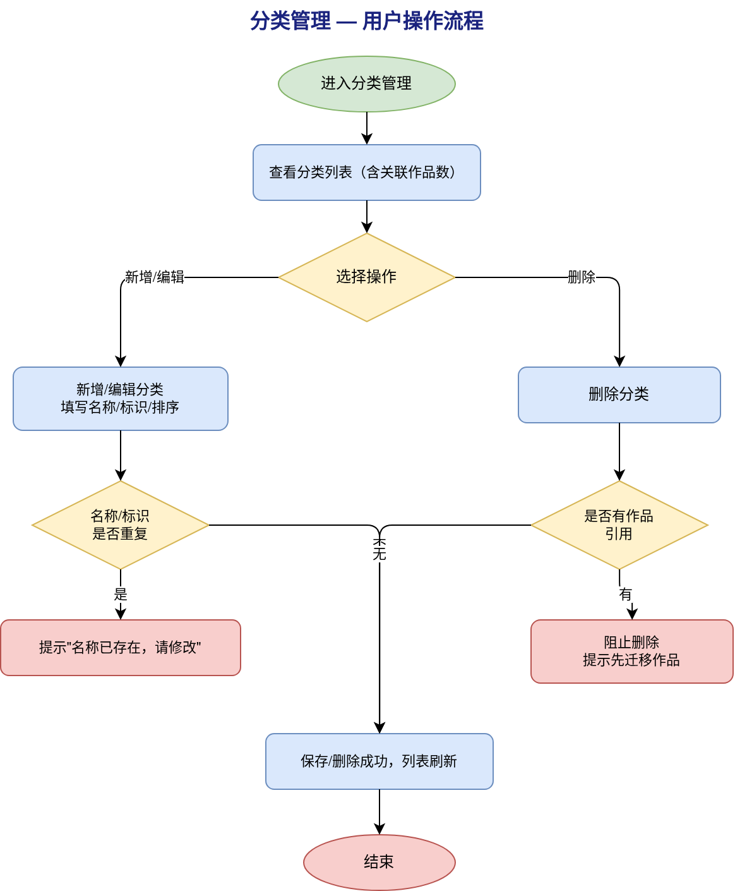

**（五）功能时序图**

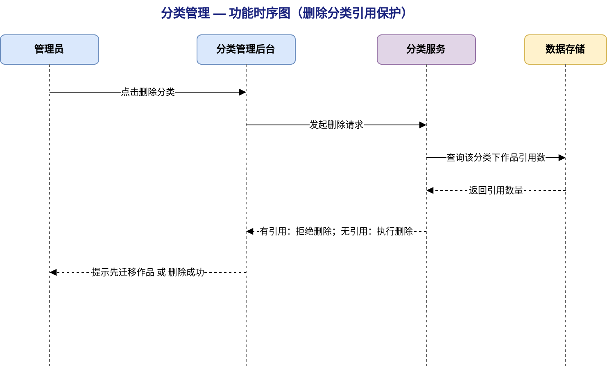

### 3.5.3 时间轴管理

**（一）功能需求概述**

时间轴管理功能用于维护成长轨迹中的年份节点记录，支持管理员对节点进行新增、编辑、删除和排序操作。已保存的时间轴节点无草稿状态，直接作为展示端成长轨迹的数据来源对访客公开展示。

**（二）功能设计**

**列表功能**

按排序值升序展示所有时间轴节点，排序值相同时按年份升序排列。

| 列名 | 字段类型 | 说明 |
|------|---------|------|
| 年份 | 数字 | 4 位公历年份 |
| 标题 | 文本 | 节点标题，必填 |
| 描述 | 文本 | 节点描述，选填，无内容显示"-" |
| 排序值 | 数字 | 值越小越靠前 |
| 操作 | 操作按钮 | 编辑、删除 |

列表为空时显示："暂无时间轴数据"。

**新增功能**

点击"新增"进入新增时间轴节点页面。

| 字段名称 | 类型 | 长度限制 | 必填 | 默认值 | 说明 |
|---------|------|---------|------|-------|------|
| 年份 | 数字输入 | 4 位整数 | 是 | - | 公历年份，如 2024 |
| 标题 | 文本输入 | 1-100 字 | 是 | - | 节点标题 |
| 描述 | 长文本输入 | 0-500 字 | 否 | - | 对该年份的说明 |
| 排序值 | 数字输入 | 正整数 | 是 | - | 值越小展示越靠前 |

提交成功：提示"保存成功"，节点立即出现在列表中并在展示端成长轨迹中展示。
提交失败：保留填写内容，显示具体错误原因。

**编辑功能**

点击"编辑"，自动填入当前时间轴节点数据，表单字段同新增。
提交成功：提示"保存成功"，列表及展示端成长轨迹同步更新为最新内容。

**删除功能**

点击"删除"，弹出确认："确认删除该时间轴节点？删除后不可恢复"。
确认后该节点从列表移除，展示端成长轨迹中不再显示该节点。

**排序功能**

管理员通过修改排序值调整节点展示顺序，排序值变更并保存后，展示端成长轨迹按最新顺序重新排列。

**业务规则**

- 年份为必填字段。提交时若年份为空或不是 4 位整数格式，阻止提交，提示"请输入有效的年份（如 2024）"。
- 标题为必填字段。提交时若标题为空，阻止提交，提示"标题不能为空"。
- 排序值变更并保存后，展示端成长轨迹按照最新排序值重新排列展示所有节点，管理员无需执行其他操作。

**边界与异常**

- **空数据**：列表无时间轴节点时，显示"暂无时间轴数据"。
- **已保存即公开**：时间轴节点无草稿状态，保存后立即在展示端对访客可见。

**（三）业务逻辑关联**

- 时间轴节点与作品、分类无关联，独立维护，删除节点不影响任何作品数据。
- 时间轴节点的年份、标题、描述、排序值，是展示端成长轨迹功能的唯一数据来源；节点的增删改操作实时影响展示端的轨迹展示结果。
- 节点无草稿状态，已保存即对访客公开。

**（四）用户操作流程图**

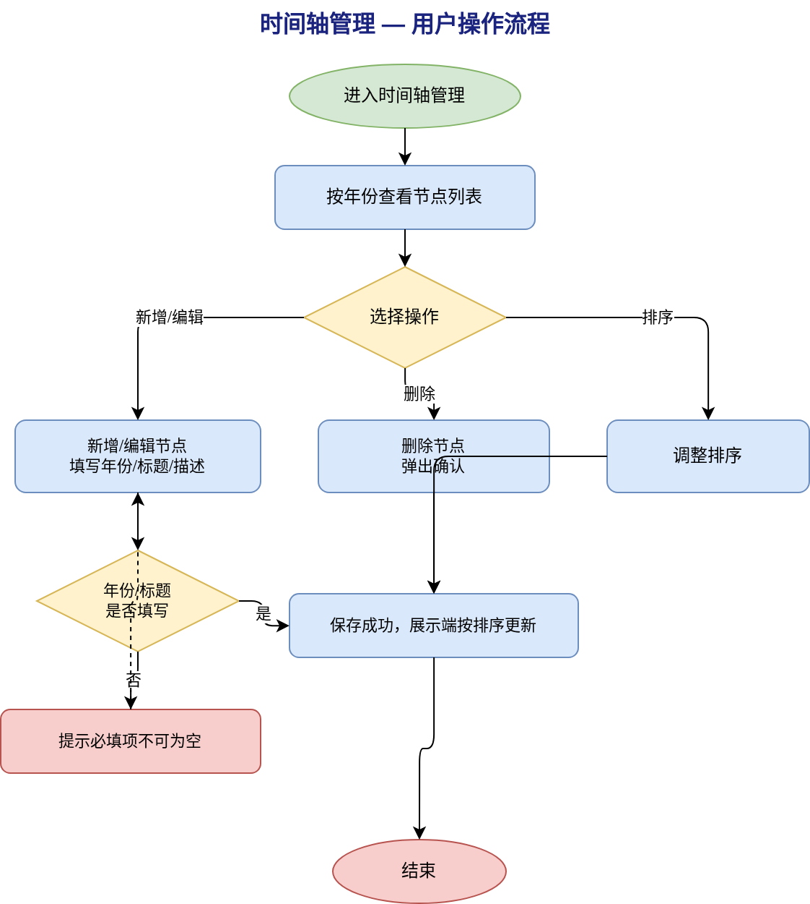

**（五）功能时序图**

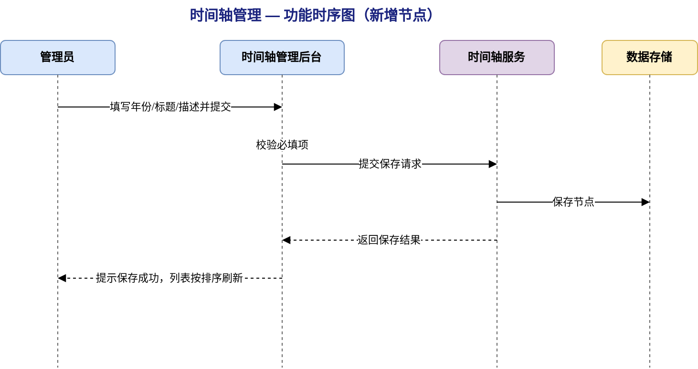

### 3.5.4 关于我管理

关于我管理模块负责维护展示端"关于我"页面的全部内容，包含管理员的个人介绍与技能两个子模块。管理员可在此更新个人简介、头像及简历，并对技能条目进行维护，所有变更保存后立即同步至展示端。

#### 3.5.4.1 个人介绍

**（一）功能需求概述**

个人介绍功能用于维护管理员在展示端"关于我"页面呈现的核心身份信息。系统中该记录全局唯一，管理员直接在现有记录上编辑并保存，无需新增或删除操作。保存成功后，展示端"关于我"页面的个人介绍内容同步更新。

**（二）功能设计**

**个人介绍编辑功能**

管理员进入关于我管理页面后，系统自动填入当前已保存的个人介绍数据，管理员可直接修改各字段后提交保存。

| 字段名称 | 类型 | 必填 | 说明 |
|---------|------|------|------|
| 简介 | 文本输入 | 是 | 对管理员身份与定位的简短描述 |
| 头像 | 图片上传 | 否 | 管理员个人头像，最多上传 1 张，单张最大 5MB，支持常见图片格式 |
| 简历 | 富文本编辑 | 否 | 支持格式化排版的详细履历内容 |

提交成功：显示提示"保存成功"，展示端"关于我"页面个人介绍同步更新为最新内容。

**业务规则**

- 简介为空时，阻止提交保存，提示"个人简介不能为空"。
- 保存操作为覆盖写入，每次保存后以最新提交内容为准。

**边界与异常**

- **首次进入**：若系统尚未保存过个人介绍数据，所有字段显示为空，等待管理员首次填写并保存。
- **保存失败**：保留当前填写内容，显示具体错误原因。

**（三）业务逻辑关联**

- 个人介绍数据是展示端"关于我"页面的身份信息来源，保存后展示端实时读取最新内容。
- 本模块独立维护，与作品管理、分类管理无关联。

#### 3.5.4.2 技能管理

**（一）功能需求概述**

技能管理功能用于维护管理员在展示端"关于我"页面能力展示区域的技能条目。管理员可新增、编辑、删除技能，并通过排序值控制各技能在展示端的排列顺序。技能列表数据是展示端能力展示的唯一数据来源。

**（二）功能设计**

**技能列表功能**

以列表形式展示所有已录入的技能条目，按排序值从小到大排列。

| 列名 | 字段类型 | 说明 |
|-----|---------|------|
| 技能名称 | 文本 | 技能的名称 |
| 评分值 | 数值 | 技能评分，取值范围 0 到 100 |
| 排序值 | 数值 | 数值越小，在展示端排列越靠前 |
| 操作 | 操作按钮 | 编辑、删除 |

列表为空时显示："暂无技能数据"。

**新增功能**

点击"新增"进入新增技能操作，填写以下字段后提交保存：

| 字段名称 | 类型 | 必填 | 说明 |
|---------|------|------|------|
| 技能名称 | 文本输入 | 是 | 技能的名称描述 |
| 评分值 | 整数输入 | 是 | 取值范围 0 到 100（含端点值） |
| 排序值 | 整数输入 | 是 | 数值越小，在展示端排列越靠前 |

提交成功：新增技能条目出现在列表中，按排序值重新排列。

**编辑功能**

点击"编辑"，系统自动填入当前技能条目的已有数据，表单字段同新增。
提交成功：对应技能条目数据更新，列表按排序值重新排列。

**删除功能**

点击"删除"，弹出确认："确认删除该技能？删除后不可恢复"。确认后删除该技能条目，列表实时更新。

**业务规则**

- 技能名称为空时，阻止提交保存，提示"技能名称不能为空"。
- 评分值不在 0 到 100 范围内时，阻止提交保存，提示"评分值须在 0 到 100 之间"。
- 排序值决定技能在展示端能力展示区域的排列顺序，排序值越小越靠前；排序值相同时，按录入时间从早到晚排列。
- 技能数据的任何变更（新增、编辑、删除）均实时影响展示端能力展示区域。

**边界与异常**

- **空列表**：技能列表中无任何条目时，显示"暂无技能数据"。
- **保存失败**：保留当前填写内容，显示具体错误原因。

**（三）业务逻辑关联**

- 技能列表数据是展示端"关于我"页面能力展示区域的唯一数据来源，技能条目的新增、编辑、删除均实时影响展示端呈现内容。
- 本模块独立维护，与作品管理、分类管理无关联。

**（四）用户操作流程图**

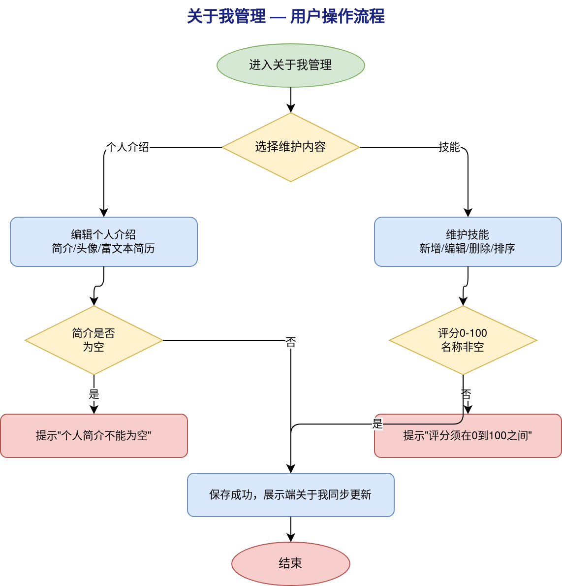

**（五）功能时序图**

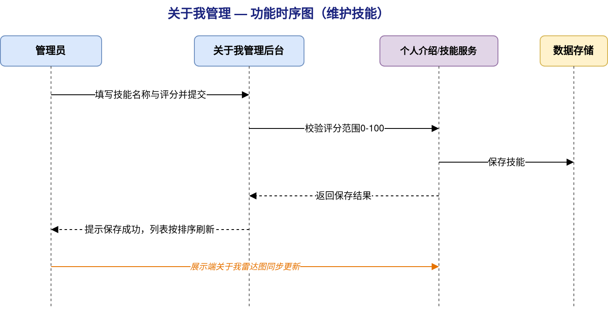

### 3.5.5 首页配置

**（一）功能需求概述**

首页配置用于维护展示站点首页的对外展示文案与精选作品数据。该模块为单条固定记录，管理员只需编辑，无需新增或删除。保存后，展示端首页立即呈现最新内容，是访客进入作品集首页时看到的第一层信息的唯一来源。

**（二）功能设计**

**展示文案编辑功能**

管理员进入首页配置后，系统自动填入当前已保存的文案内容，直接编辑并保存即可生效。

| 字段名称 | 类型 | 长度限制 | 必填 | 默认值 | 说明 |
|---------|------|---------|------|-------|------|
| 展示标语 | 文本输入 | 1–50字 | 是 | - | 展示端首页主标题文案 |
| 副标题 | 文本输入 | 0–100字 | 否 | - | 展示端首页副标题文案，不填则不展示 |

保存成功：提示"保存成功"，展示端首页立即生效。

**精选作品选取功能**

管理员从候选池中多选作品，保存后展示端首页精选区展示所选作品。系统自动填入当前已选作品，管理员可增减选取。候选池来源于作品管理中发布状态为已发布且精选标记为是的作品，草稿状态作品不进入候选池。

| 字段名称 | 类型 | 长度限制 | 必填 | 默认值 | 说明 |
|---------|------|---------|------|-------|------|
| 精选作品 | 多选 | - | 否 | - | 来源于作品管理中已发布且精选标记为是的作品，逐个展示，支持移除 |

保存成功：提示"保存成功"，展示端首页精选区立即更新为当前所选作品。

**业务规则**

- 展示标语为空时，阻止保存，提示"展示标语不能为空"。
- 保存操作完成后，展示端首页展示文案即时更新，无需额外发布操作。
- 候选池仅展示发布状态为已发布且精选标记为是的作品；草稿作品不出现在候选池中。
- 已选入首页的作品若被下架（改为草稿），该作品即时从展示端首页精选区移除，不再对访客展示（草稿隔离）。
- 精选作品数量不设上限，管理员可选取任意数量。

**边界与异常**

- **副标题为空**：展示端首页不展示副标题区域，不显示空白占位。
- **候选池为空**：无符合条件的作品时，候选池显示"暂无可选作品"，不影响展示文案的保存操作。
- **精选作品为空**：管理员未选取任何精选作品时，展示端首页精选区显示"暂无精选作品"，不报错。
- **保存失败**：保留管理员已填写的内容，显示具体失败原因，不丢失未保存数据。

**（三）业务逻辑关联**

- 精选作品候选池数据来源于作品管理，需作品管理中存在发布状态为已发布且精选标记为是的作品，候选池才有内容可选。
- 作品管理中的发布状态与精选标记变更，实时影响首页配置候选池的可选范围；已选中的作品若状态变更为草稿，展示端首页立即执行草稿隔离，移除该作品展示。
- 首页配置为展示端首页提供展示文案（展示标语、副标题）与精选作品两类数据，展示端首页内容完全依赖本模块配置。

**（四）用户操作流程图**

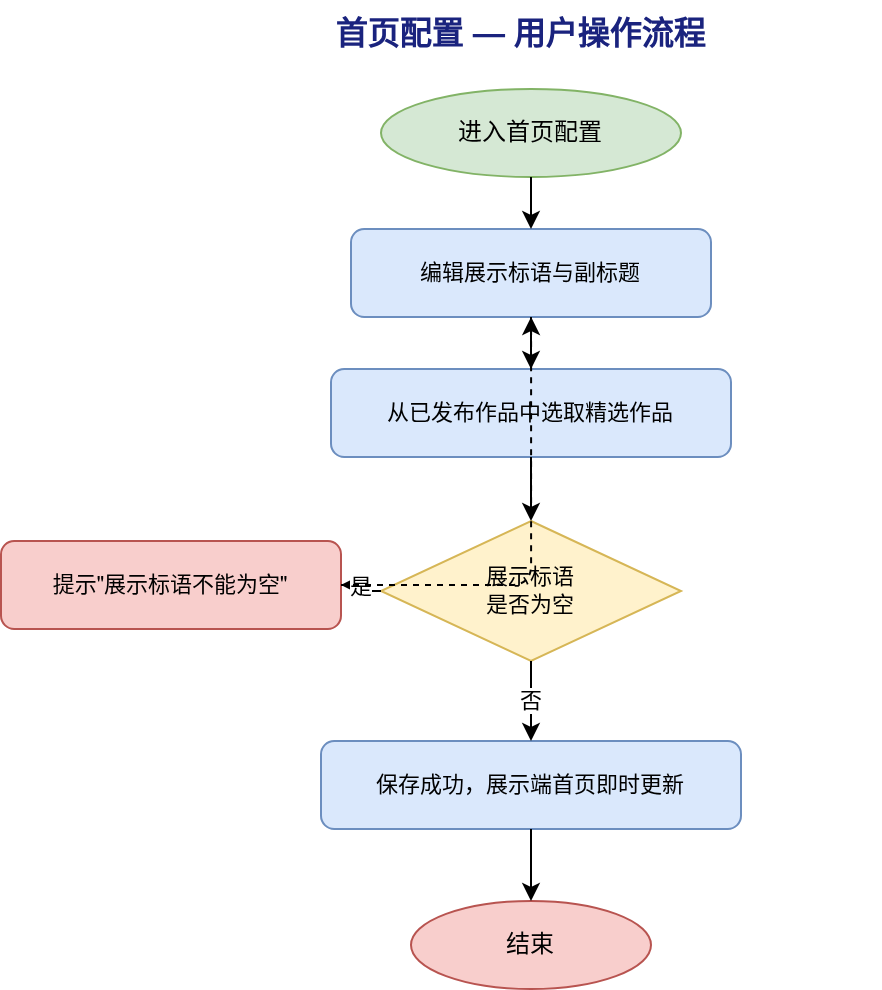

**（五）功能时序图**

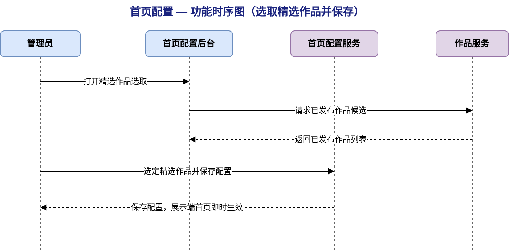

### 3.5.6 数据统计

**（一）功能需求概述**

数据统计功能面向管理员，集中展示各作品的访问情况，帮助管理员了解哪些作品受访客关注、各作品的访问热度分布。本模块为只读展示，不提供任何编辑操作。

**（二）功能设计**

**作品访问量排行列表**

按访问量降序展示已发布作品的访问情况，支持分页浏览。列表为只读展示，不提供新增、编辑、删除等操作入口。

| 列名 | 字段类型 | 说明 |
|------|---------|------|
| 排名 | 数字 | 按访问量降序自动生成序号，从第 1 名起排列 |
| 作品标题 | 文本 | 对应作品的标题 |
| 所属分类 | 文本 | 作品归属的分类名称，来源于分类管理中已有的分类；无值显示"-" |
| 访问量 | 数字 | 该作品被访客访问的累计次数（已按去重规则统计） |

分页默认每页 10 条。

**业务规则**

- 访客在展示端访问作品详情时，对应作品的访问量自动累加 1；同一访客来源在 24 小时内重复访问同一作品，仅计入 1 次，超过 24 小时后再次访问方可再次累加。
- 排行仅统计发布状态为"已发布"的作品，草稿作品不纳入统计；访问量相同的作品，按发布时间倒序排列（发布时间较晚的排在前）。
- 后台展示的访问量数据为只读，管理员不可手动修改。

**边界与异常**

- **空数据**：当无已发布作品，或所有已发布作品均无访问记录时，显示"暂无访问数据"。
- **访问量为零**：已发布作品访问量为 0 时，纳入排行展示，访问量显示"0"，不隐藏。

**（三）业务逻辑关联**

- 访问量数据来源于作品管理中的已发布作品，由展示端访客访问作品详情时自动触发累加；作品管理模块是本统计的数据基础。
- 所属分类字段来源于分类管理，分类名称与分类管理中保持一致。
- 作品下架（状态变更为草稿）后，该作品从排行列表中移除；重新发布后恢复展示，历史访问量保留。

**（四）用户操作流程图**

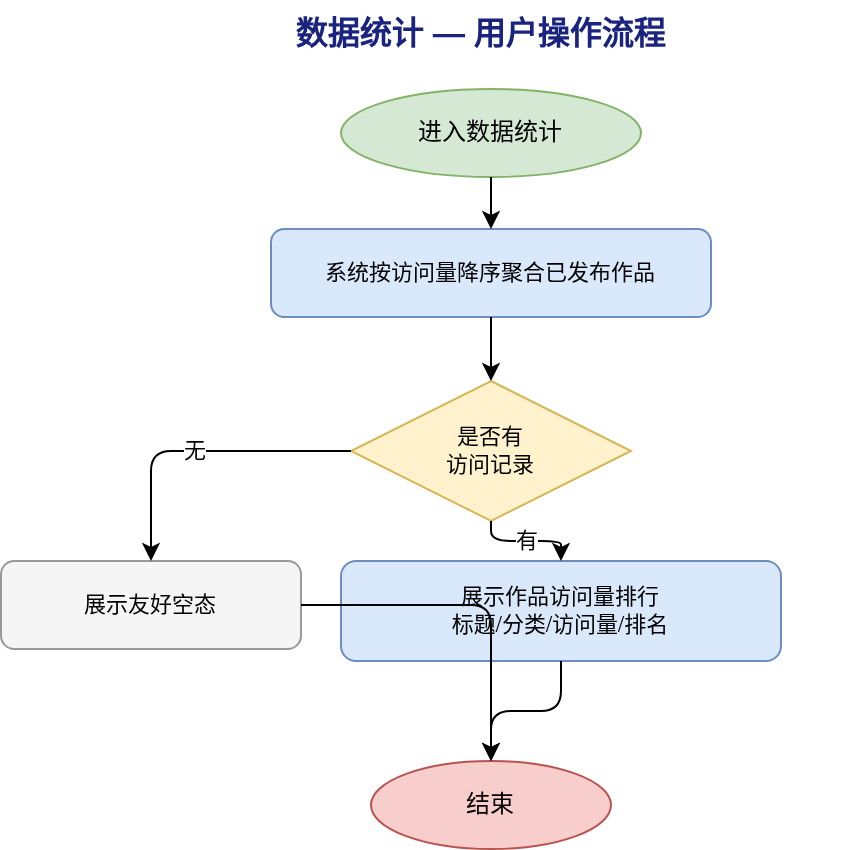

**（五）功能时序图**

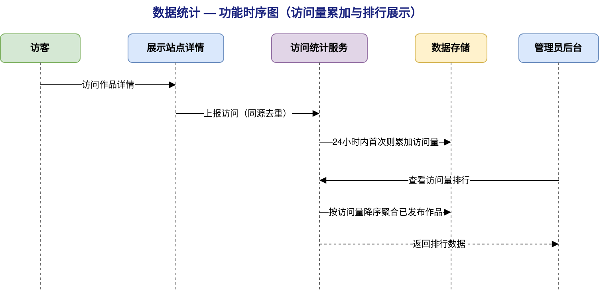

### 3.5.7 展示站点

展示站点是面向访客的公开只读前端，访客无需登录即可浏览。站点仅展示已发布的作品、原型版本、拆解文章及个人信息，草稿内容在全站隔离不可见。展示站点不提供任何新增、编辑、删除操作，所有数据均来源于管理后台各模块的已发布内容。

#### 3.5.7.1 首页

**（一）功能需求概述**

首页是展示站点的入口页面，向访客展示个人标语、副标题及精选作品，引导访客进一步了解作品集内容。首页内容由管理员在首页配置中维护，精选作品反映管理员主动筛选的代表性作品。

**（二）功能设计**

**首页展示内容**

| 展示项 | 数据来源 | 说明 |
|--------|---------|------|
| 标语 | 首页配置 | 展示管理员填写的主标语文案 |
| 副标题 | 首页配置 | 展示管理员填写的副标题文案 |
| 入口导航 | 固定 | 提供前往作品列表、时间轴、关于我三个浏览入口 |
| 精选作品列表 | 首页配置所选已发布作品 | 展示每件精选作品的封面、标题、简介；点击进入对应作品详情 |

**业务规则**

- 精选作品列表仅展示发布状态为"已发布"的作品；已下架（发布状态变更为草稿）的精选作品自动从首页隐藏，不计入展示数量。
- 精选作品列表为空时（首页配置未选取任何已发布作品），该区域显示友好空态提示，不报错。
- 标语与副标题未填写时，对应展示区域显示友好空态，不报错。

**边界与异常**

- **精选作品为空**：显示"暂无精选作品"提示。
- **首页配置未保存**：各展示区域均显示友好空态，不影响页面整体展示。

**（三）业务逻辑关联**

- 标语、副标题、精选作品选取来源于首页配置模块，需管理员在后台完成配置后方可展示。
- 精选作品的发布状态受作品管理模块控制；作品发布状态变更为草稿后，首页精选列表中对应作品自动隐藏。
- 入口导航指向作品列表（3.5.7.2）、时间轴（3.5.7.4）、关于我（3.5.7.5）三个子页面。

#### 3.5.7.2 作品列表

**（一）功能需求概述**

作品列表页面向访客展示所有已发布的作品，支持按分类筛选浏览。访客可通过分类筛选快速定位感兴趣的作品方向，点击后进入作品详情查看完整内容。

**（二）功能设计**

**分类筛选**

| 展示项 | 数据来源 | 说明 |
|--------|---------|------|
| 分类筛选项 | 分类管理中所有分类 | 按分类排序展示，含"全部"默认选项 |

访客选择某一分类后，作品列表仅展示属于该分类的已发布作品；选择"全部"时展示所有已发布作品。

**作品列表展示**

| 展示项 | 数据来源 | 说明 |
|--------|---------|------|
| 作品封面 | 作品管理 | 展示作品封面图；无封面显示占位图 |
| 作品标题 | 作品管理 | 展示作品标题 |
| 作品简介 | 作品管理 | 展示作品简介文案 |

作品列表按作品排序字段升序展示。点击任一作品进入对应作品详情页。

**业务规则**

- 仅展示发布状态为"已发布"的作品，草稿作品在列表中不可见。
- 选中某一分类时，仅展示该分类下发布状态为"已发布"的作品；该分类下无已发布作品时，显示"暂无作品"提示。
- 所有分类下均无已发布作品时，列表显示"暂无作品"提示。

**边界与异常**

- **列表为空**：显示"暂无作品"提示。
- **分类筛选项为空**：无分类时仅显示"全部"选项，作品列表正常展示。

**（三）业务逻辑关联**

- 分类筛选项数据来源于分类管理模块，分类的排序与管理员在分类管理中维护的排序保持一致。
- 作品数据来源于作品管理模块；作品发布状态、所属分类、排序均在作品管理中维护。
- 点击作品进入 3.5.7.3 作品详情页。

#### 3.5.7.3 作品详情

**（一）功能需求概述**

作品详情页向访客完整展示单件作品的富文本详情、原型版本与原型图片、以及相关拆解文章。访客可在多个原型版本间切换查看，并支持放大查看原型图片。每次访问详情时系统记录访问量，同一来源在 24 小时内重复访问只计一次。

**（二）功能设计**

**作品基本信息展示**

| 展示项 | 数据来源 | 说明 |
|--------|---------|------|
| 作品标题 | 作品管理 | 展示作品标题 |
| 作品详情 | 作品管理 | 以富文本形式展示作品详细介绍内容 |

**原型版本展示**

| 展示项 | 数据来源 | 说明 |
|--------|---------|------|
| 原型版本列表 | 原型管理 | 展示该作品下所有原型版本，按排序展示；访客可切换查看不同版本 |
| 原型图片 | 原型管理 | 展示当前选中原型版本下的所有原型图片，按排序展示；每张图片含对应说明文字；支持放大查看单张原型图片 |

访客切换原型版本后，原型图片区域同步更新为该版本下的图片列表。

**拆解文章展示**

| 展示项 | 数据来源 | 说明 |
|--------|---------|------|
| 拆解文章列表 | 拆解管理 | 展示该作品下所有已发布的拆解文章，按排序展示；展示每篇文章的标题与正文 |

**业务规则**

- 访客访问作品详情时，该作品的访问量累加 1 次；同一来源在 24 小时内重复访问同一作品详情，不重复计入访问量。
- 仅已发布的作品详情页可正常访问；访客直接访问草稿作品的详情时，显示友好提示"该作品暂不可查看"，不展示任何内容。
- 拆解文章仅展示发布状态为"已发布"的条目，草稿拆解文章不对访客可见。
- 该作品无原型版本时，原型区域显示"暂无原型版本"提示。
- 该作品无已发布拆解文章时，拆解区域显示"暂无拆解文章"提示。

**边界与异常**

- **访问草稿作品**：显示"该作品暂不可查看"，页面不展示作品任何内容。
- **原型版本为空**：显示"暂无原型版本"提示。
- **当前版本无原型图片**：原型图片区域显示"暂无原型图片"提示。
- **拆解文章为空**：显示"暂无拆解文章"提示。

**（三）业务逻辑关联**

- 作品标题与富文本详情来源于作品管理模块；作品发布状态在作品管理中维护。
- 原型版本与原型图片来源于原型管理模块，与所属作品通过作品唯一标识关联；原型版本和图片的排序在原型管理中维护。
- 拆解文章来源于拆解管理模块，与所属作品关联；拆解文章的发布状态与排序在拆解管理中维护。
- 访问量由系统在访客访问详情时自动记录，在作品管理后台列表与数据统计中可查看累计访问量。

#### 3.5.7.4 时间轴

**（一）功能需求概述**

时间轴页面向访客展示管理员的成长轨迹，以年份节点形式呈现重要经历与里程碑事件。内容由管理员在时间轴管理中维护，按排序依次呈现。

**（二）功能设计**

**时间轴节点展示**

| 展示项 | 数据来源 | 说明 |
|--------|---------|------|
| 年份 | 时间轴管理 | 展示该节点对应的年份 |
| 节点标题 | 时间轴管理 | 展示该年份节点的标题 |
| 节点描述 | 时间轴管理 | 展示该年份节点的详细描述内容 |

所有时间轴节点按管理员在时间轴管理中设定的排序依次展示。

**业务规则**

- 无时间轴节点时，页面显示"暂无时间轴数据"提示。

**边界与异常**

- **节点为空**：显示"暂无时间轴数据"提示，不报错。

**（三）业务逻辑关联**

- 时间轴节点数据来源于时间轴管理模块，节点的年份、标题、描述及排序均在时间轴管理中维护。
- 时间轴管理中新增、编辑或删除节点后，展示站点时间轴页面同步反映最新内容。

#### 3.5.7.5 关于我

**（一）功能需求概述**

关于我页面向访客展示管理员的个人简介、头像、富文本简历及技能能力情况，帮助访客全面了解作品集主人的背景与专业能力。内容由管理员在关于我管理中维护。

**（二）功能设计**

**个人介绍展示**

| 展示项 | 数据来源 | 说明 |
|--------|---------|------|
| 头像 | 关于我管理 | 展示管理员上传的头像图片；未上传时显示默认占位图 |
| 个人简介 | 关于我管理 | 展示管理员填写的一段简短个人介绍文案 |
| 富文本简历 | 关于我管理 | 以富文本形式展示管理员的详细简历内容 |

**能力展示**

| 展示项 | 数据来源 | 说明 |
|--------|---------|------|
| 技能名称 | 技能管理 | 展示每项技能的名称 |
| 技能评分 | 技能管理 | 展示该技能的评分数值 |

所有技能按管理员在技能管理中设定的排序依次展示。

**业务规则**

- 个人介绍（个人简介与富文本简历）未填写时，对应展示区域显示友好空态，不报错。
- 无技能数据时，能力展示区域显示友好空态，不报错。

**边界与异常**

- **个人介绍未填写**：对应区域显示"暂无个人介绍"提示，不影响页面其他区域正常展示。
- **技能为空**：能力展示区域显示"暂无技能数据"提示，不报错。

**（三）业务逻辑关联**

- 头像、个人简介、富文本简历来源于关于我管理模块中的个人介绍配置。
- 技能名称与评分来源于技能管理模块，技能的排序在技能管理中维护。
- 关于我管理或技能管理中内容更新后，展示站点关于我页面同步展示最新内容。

**（四）用户操作流程图**

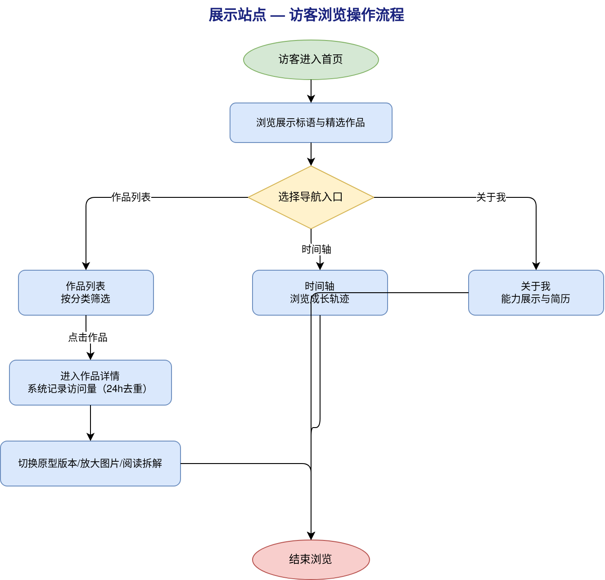

**（五）功能时序图**

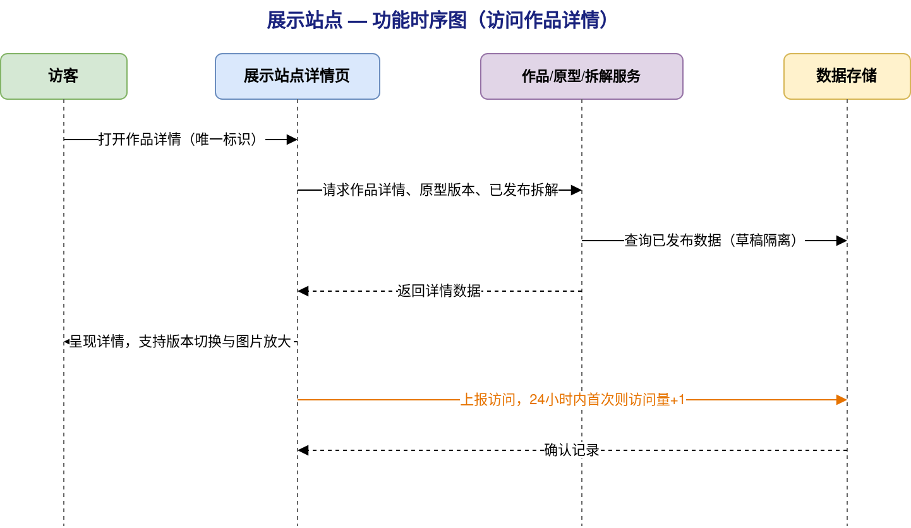

---

## 四、技术方案

### 4.1 技术架构

本系统采用前后端分离架构，由管理后台、展示站点、后端服务三部分组成：

- **管理后台**：基于 Vue 3 + TypeScript + Element Plus 构建的单页应用，供管理员维护内容。
- **展示站点**：基于 Vue 3 + TypeScript + TailwindCSS 构建的单页应用，面向访客公开展示。
- **后端服务**：基于 NestJS + Prisma 构建，提供业务数据接口与登录认证，数据存储采用 MySQL。
- **部署**：前端构建为静态资源经由 Nginx 提供，后端以容器化方式部署，统一通过反向代理对外提供服务。

### 4.2 数据交互

- 前后端通过 HTTP 接口交互，数据格式采用 JSON。
- 管理后台接口需登录认证后访问；展示站点接口为公开只读，仅返回已发布内容。
- 图片等文件通过后端文件上传能力处理，返回可访问的资源地址。
- 接口遵循统一的请求与响应规范，包含状态标识、数据体与错误信息。

### 4.3 安全方案

- **身份认证**：管理后台采用账号密码登录，登录后凭令牌访问受保护接口。
- **访问控制**：管理后台接口仅认证管理员可访问；展示站点接口仅返回已发布内容，草稿数据不对外暴露。
- **数据传输**：对外服务采用加密传输。
- **输入校验**：对管理员输入及外部请求参数进行校验，防止非法数据写入。

---

## 五、非功能需求

### 5.1 性能需求

- 页面加载时间 < 3 秒，接口响应时间 < 1 秒。
- 展示站点支持常规访客并发浏览。
- 列表数据分页加载，避免一次性加载过多数据。

### 5.2 安全需求

- 身份认证：管理后台账号密码登录。
- 数据安全：敏感数据加密存储，传输使用加密通道。
- 访问控制：草稿内容全站隔离，仅认证管理员可见。

### 5.3 可用性需求

- 系统可用性目标 99.9%。
- 各列表、详情、展示页面无数据时展示友好空态，不报错。
- 数据定期备份，保障数据可恢复。

### 5.4 兼容性需求

- 浏览器：Chrome、Firefox、Safari、Edge 最新版本。
- 设备：PC 端为主，展示站点适配常见屏幕尺寸。

---

## 六、数据需求

### 6.1 数据字典

| 枚举类型 | 枚举值 | 说明 |
|---------|-------|------|
| 作品发布状态 | 草稿 | 仅后台可见，展示端不公开 |
| ^ | 已发布 | 展示端可见 |
| 拆解文章发布状态 | 草稿 | 仅后台可见，展示端不公开 |
| ^ | 已发布 | 展示端可见 |
| 精选标记 | 是 | 用于首页精选展示 |
| ^ | 否 | 不参与首页精选 |

### 6.2 数据存储要求

- 作品、原型版本、原型图片、拆解文章、分类、时间轴节点、技能、个人介绍、首页配置、访问量等业务数据持久化存储。
- 图片文件存储于服务端文件目录，记录可访问地址。
- 数据定期备份，重要数据保留期限不少于 1 年。

---

## 八、项目实施与验收

### 8.1 实施阶段

1. **需求确认阶段**：需求评审、设计确认、需求基线锁定。
2. **设计开发阶段**：数据模型设计、后端接口开发、管理后台与展示站点开发、单元测试。
3. **测试部署阶段**：功能测试、联调测试、用户验收测试、部署上线。
4. **上线运行阶段**：试运行、问题修复、正式上线。

### 8.2 验收标准

- **功能验收**：所有功能按本说明书实现，无 P0/P1 级缺陷。
- **性能验收**：满足第五章非功能需求指标。
- **文档验收**：提供完整的技术文档与操作说明。

---

## 九、附录

### 附录A：术语表

| 术语 | 说明 |
|-----|------|
| 作品 | 系统核心实体，代表一件设计/开发作品 |
| 唯一标识 | 作品或分类的路径标识符，全局唯一 |
| 原型版本 | 作品的某个迭代版本，如 V1/V2/V3 |
| 原型图片 | 原型版本下的截图 |
| 拆解文章 | 对作品的分析解读内容，富文本形式 |
| 分类 | 作品的归属类别 |
| 时间轴节点 | 成长轨迹中的一条年份记录 |
| 技能 | 关于我中的能力项，含名称与评分 |
| 访问量 | 作品详情被访问的累计次数（已去重） |
| 草稿隔离 | 草稿状态内容不对展示端公开 |
| 级联删除 | 删除作品时一并删除其原型版本、原型图片、拆解文章 |
| SRS | 软件需求规格说明书（Software Requirements Specification） |

### 附录B：参考资料

- 《作品时光个人作品集系统设计方案 v1.0》

