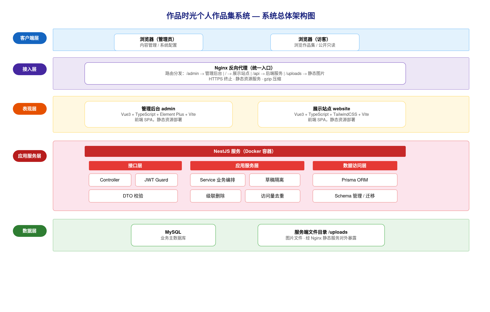
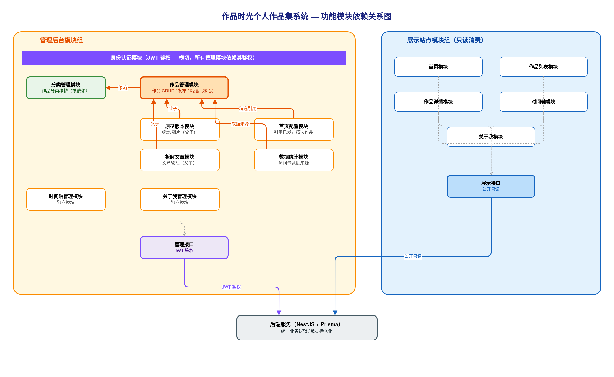
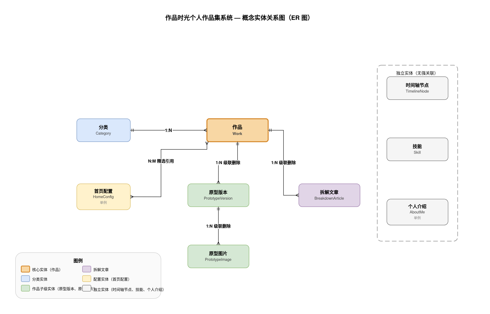
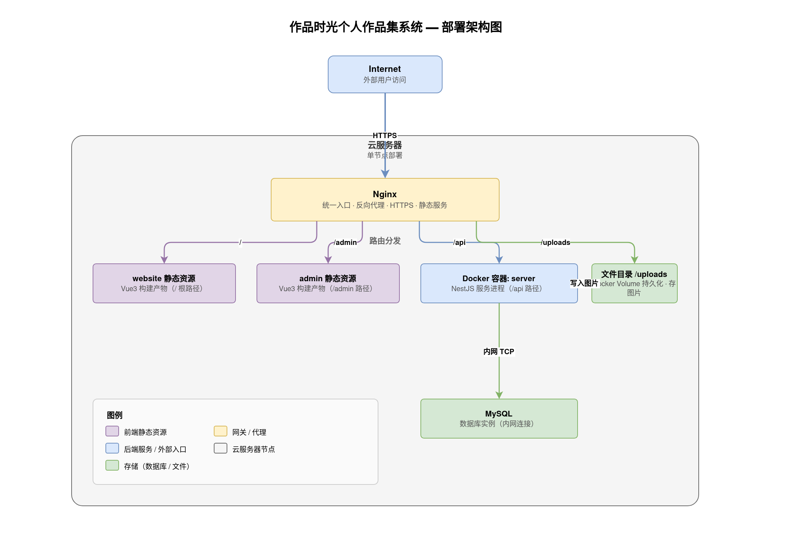

## 一、文档信息

| 项目名称 | 作品时光个人作品集系统 |
|---------|-----------|
| 文档版本 | V1.1 |
| 编制日期 | 2026-06-28 |
| 编制人 | 个人 |
| 关联需求文档 | 20260628-个人作品时光个人作品集系统-SRS需求规格说明书-V1.0.md |
| 文档状态 | 草稿 |

**历史版本**

| 版本 | 日期 | 作者 | 更改说明 |
|-----|------|------|---------|
| V1.0 | 2026-06-28 | 个人 | 初始版本 |
| V1.1 | 2026-06-28 | 个人 | 审查修复：统一对外接口 HTTPS、公共机制去实现化、补充图片静态服务说明、修正可用性与超时表述（6 处） |

---

## 二、引言

### 2.1 编写目的

本概要设计说明书用于描述作品时光个人作品集系统的总体技术架构设计，作为详细设计（LLD）与编码实现的架构依据。文档以《作品时光个人作品集系统 SRS 需求规格说明书 V1.0》为输入，将功能需求转化为系统分层、模块划分、数据架构、接口架构、技术选型与部署方案。

预期读者包括系统架构师、技术负责人与开发人员。本文档写至模块、实体、接口分组级，字段级表结构与单接口明细在详细设计阶段展开。

### 2.2 设计依据

- 《作品时光个人作品集系统 SRS 需求规格说明书 V1.0》
- 《作品时光个人作品集系统 设计方案 v1.0》
- 前后端分离架构设计实践
- 主流开源技术栈（Vue 3、NestJS、Prisma、MySQL）官方设计指南

### 2.3 术语与缩略语

| 术语 | 说明 |
|-----|------|
| HLD | 概要设计说明书（High Level Design） |
| LLD | 详细设计说明书（Low Level Design） |
| SRS | 软件需求规格说明书（Software Requirements Specification） |
| SPA | 单页应用（Single Page Application） |
| ORM | 对象关系映射（Object Relational Mapping） |
| JWT | JSON Web Token，无状态身份令牌 |
| DTO | 数据传输对象（Data Transfer Object） |
| 草稿隔离 | 草稿状态内容不对展示端公开，仅后台可见的机制 |
| 级联删除 | 删除作品时一并删除其原型版本、原型图片、拆解文章 |
| Monorepo | 单一代码仓库管理多个子项目的工程组织方式 |

## 三、系统总体设计

### 3.1 系统定位

作品时光是一套面向个人的作品集内容管理与对外展示系统。系统由管理后台与展示站点两个前端应用，以及统一的 NestJS 后端服务构成。

管理员通过管理后台集中维护作品信息、原型版本迭代、项目拆解文章、分类、时间轴节点及个人介绍等全部内容；访客通过展示站点无需登录即可浏览已发布的公开内容。系统采用草稿隔离机制，未发布内容对访客不可见。

目标用户为两类：单一管理员账号（拥有全部写权限）与不特定访客（只读浏览已发布内容）。核心能力包括作品集中管理（含原型版本化、项目拆解）、站点内容可配置、草稿与已发布内容隔离展示、作品访问热度统计。

### 3.2 系统边界

| 边界项 | 说明 |
|--------|------|
| 管理后台职责 | 内容 CRUD、发布控制、精选标记、封面管理、首页文案配置、访问量统计查看 |
| 展示站点职责 | 已发布内容只读展示、访问量记录（浏览触发） |
| 后端服务职责 | 业务逻辑处理、数据持久化、JWT 身份认证、文件存储管理、统一接口响应封装 |
| 不在范围：多用户协作 | 系统为单管理员设计，不支持多用户角色权限分配与协作流程 |
| 不在范围：行为分析 | 不提供全站行为埋点、漏斗分析等数据分析能力 |
| 不在范围：CDN 集成 | 图片与静态资源由服务端本地目录经 Nginx 静态服务提供，不集成第三方 CDN |
| 不在范围：社交互动 | 不支持评论、收藏、点赞等社交功能 |
| 外部系统依赖 | 系统独立自闭合，无外部系统集成；唯一对外入口为浏览器客户端经 Nginx 访问 |

### 3.3 系统总体架构图

架构共分五层，从上至下依次为：

**客户端层**：管理员与访客均通过浏览器访问系统。管理员使用管理后台（admin），访客使用展示站点（website），两者均为 SPA 单页应用，运行于用户侧浏览器。

**接入层**：Nginx 作为统一入口，承担反向代理、HTTPS 终止、静态资源服务（SPA 构建产物与 uploads 图片目录）、响应 gzip 压缩等职责。前端路由请求统一由 Nginx 处理，API 请求转发至后端服务，静态资源直接由 Nginx 响应，不经过应用服务。

**表现层**：admin 前端基于 Vue 3 + TypeScript + Vite + Element Plus 构建，提供后台管理交互界面；website 前端基于 Vue 3 + TypeScript + Vite + TailwindCSS 构建，提供面向访客的展示界面。两个前端独立部署，通过 HTTP 接口与后端服务通信。

**应用服务层**：NestJS 容器内部分三个子层。接口层（Controller + Guard + DTO）负责 HTTP 路由分发、JWT 鉴权拦截及请求数据校验；应用服务层（Service）负责业务逻辑编排，包含草稿隔离、级联删除、访问量去重等核心策略；数据访问层通过 Prisma ORM 统一操作数据库，封装关联查询与事务。

**数据层**：MySQL 存储全部业务数据；服务端文件目录（uploads/）存储上传的图片文件，经 Nginx 静态服务对外暴露，不经过应用服务层。

## 四、应用架构

### 4.1 分层设计

| 分层 | 职责 | 关键技术 |
|------|------|----------|
| 表现层 | 用户交互与页面渲染，管理后台提供内容维护操作界面，展示站点提供访客只读浏览界面 | Vue 3、TypeScript、Vite；admin 使用 Element Plus，website 使用 TailwindCSS |
| 接口层 | HTTP 路由分发、请求体 DTO 校验、JWT Guard 鉴权拦截、统一响应格式封装 | NestJS Controller、NestJS Guard、class-validator DTO |
| 应用服务层 | 业务逻辑编排、跨资源事务协调、草稿隔离策略、级联删除、访问量去重计算 | NestJS Service、Prisma 事务 |
| 数据访问层 | 数据持久化、关联查询、事务边界管理，屏蔽底层数据库细节 | Prisma ORM |
| 数据层 | 业务数据存储与图片文件存储 | MySQL（业务主数据）、服务端文件目录 uploads/（图片文件，经 Nginx 提供静态服务） |

### 4.2 功能模块划分

| 模块 | 职责 | 对应 SRS 功能 | 依赖模块 |
|------|------|---------------|----------|
| 身份认证模块 | JWT 登录认证、Token 签发与校验、管理后台路由守卫 | 3.4 页面访问权限 | 无 |
| 作品管理模块 | 作品 CRUD、发布状态控制、精选标记、封面图管理 | 3.5.1 作品管理 | 分类管理模块 |
| 原型版本模块 | 版本 CRUD、版本图片管理、版本与作品关联 | 3.5.1.2 原型版本 | 作品管理模块 |
| 拆解文章模块 | 文章 CRUD、发布控制、文章与作品关联 | 3.5.1.3 拆解文章 | 作品管理模块 |
| 分类管理模块 | 分类 CRUD、排序调整、删除保护（有作品引用时拒绝删除） | 3.5.2 分类管理 | 无 |
| 时间轴管理模块 | 时间轴节点 CRUD、节点排序 | 3.5.3 时间轴管理 | 无 |
| 关于我管理模块 | 个人介绍内容编辑、技能条目 CRUD | 3.5.4 关于我管理 | 无 |
| 首页配置模块 | 首页文案编辑、精选作品选取 | 3.5.5 首页配置 | 作品管理模块 |
| 数据统计模块 | 作品访问量排行只读查看 | 3.5.6 数据统计 | 作品管理模块 |
| 展示站点-首页模块 | 渲染已配置的首页文案与精选作品 | 3.5.7.1 首页 | 后端展示接口 |
| 展示站点-作品列表模块 | 按分类筛选展示已发布作品列表 | 3.5.7.2 作品列表 | 后端展示接口 |
| 展示站点-作品详情模块 | 展示作品详情、原型版本、拆解文章，记录访问量 | 3.5.7.3 作品详情 | 后端展示接口 |
| 展示站点-时间轴模块 | 展示时间轴节点成长轨迹 | 3.5.7.4 时间轴 | 后端展示接口 |
| 展示站点-关于我模块 | 展示个人介绍与技能信息 | 3.5.7.5 关于我 | 后端展示接口 |

**模块划分依据：** 按业务域划分，作品为核心聚合根，原型版本与拆解文章作为其子资源；展示站点按页面划分，统一只读消费后端展示接口。

### 4.3 模块依赖关系

模块间依赖关系及方向说明如下：

**横切依赖**：身份认证模块以 JWT Guard 形式横切所有管理后台模块，所有需要鉴权的请求均经过身份认证模块拦截校验，但身份认证模块本身不依赖任何业务模块。

**核心聚合依赖**：作品管理模块是系统核心聚合根，原型版本模块、拆解文章模块、首页配置模块、数据统计模块均依赖作品管理模块。原型版本与拆解文章为作品的子资源，依赖方向为子资源指向父资源，不可反向。

**分类依赖**：作品管理模块依赖分类管理模块（作品创建与编辑需选择分类）；分类管理模块在删除时需检查是否有关联作品（删除保护），仅为只读查询，不构成强依赖。

**独立模块**：时间轴管理模块、关于我管理模块与其他业务模块无横向依赖，独立运作。

**展示站点**：展示站点各模块统一单向只读消费后端展示接口，不直接依赖任何管理后台模块，依赖方向为展示模块指向后端接口层。

整体依赖关系无循环，遵循单向依赖原则。

## 五、数据架构

### 5.1 核心业务实体

| 实体 | 业务含义 | 关联实体 | 关系类型 |
|------|----------|----------|----------|
| Category（分类） | 作品归属类别，作为展示端筛选来源 | Work | 1:N |
| Work（作品） | 系统核心实体，聚合原型版本与拆解文章，承载发布状态、精选标记与访问量 | Category（N:1）、PrototypeVersion（1:N 级联）、BreakdownArticle（1:N 级联） | - |
| PrototypeVersion（原型版本） | 作品某次迭代版本（V1/V2/V3），承载版本说明与排序 | Work（N:1）、PrototypeImage（1:N 级联） | - |
| PrototypeImage（原型图片） | 版本下单张截图，含说明文字与显示顺序 | PrototypeVersion | N:1 |
| BreakdownArticle（拆解文章） | 作品的分析解读富文本，有独立发布状态 | Work | N:1 |
| TimelineNode（时间轴节点） | 成长轨迹年份里程碑，承载年份与事件描述 | 独立 | - |
| Skill（技能） | 关于我页面的能力项，含名称与评分 | 独立 | - |
| AboutMe（个人介绍） | 全局单例记录，承载简介、头像与简历内容 | 独立单例 | - |
| HomeConfig（首页配置） | 全局单例记录，承载首页文案与精选作品引用列表 | Work（精选，N:M） | - |

**关键约束：**

- 删除 Work 时，级联删除其下所有 PrototypeVersion、PrototypeImage、BreakdownArticle
- 删除 PrototypeVersion 时，级联删除其下所有 PrototypeImage
- 删除 Category 时，若存在关联 Work 则阻止删除
- HomeConfig 精选作品引用仅指向已发布且标记为精选的 Work；Work 下架时自动从首页精选中隐离

### 5.2 概念实体关系图

### 5.3 存储选型

| 存储类型 | 选型 | 承载数据 | 理由 |
|----------|------|----------|------|
| 关系数据库 | MySQL | 全部业务数据：作品（状态/发布/精选/访问量）、原型版本与图片元数据、拆解文章富文本、分类、时间轴节点、技能、个人介绍、首页配置、访问量去重记录 | 实体关联关系明确，外键约束与事务支持完善，适合中小规模结构化数据 |
| 文件存储 | 服务端本地目录 `uploads/` | 图片文件：封面图、原型截图、个人头像 | 个人项目规模，无需引入外部对象存储；Nginx 直接提供静态文件服务，图片访问路径以字符串形式存储于数据库 |
| 缓存 | 本期不引入 Redis | - | 数据规模小，MySQL 加索引 + 分页 + Nginx gzip 即可满足接口响应 < 1s 要求；访问量去重以数据库唯一约束（来源标识 + 作品 + 日期）实现，不依赖缓存，降低部署复杂度 |

## 六、接口架构

### 6.1 接口分组

| 接口分组 | 所属模块 | 对外/对内 | 协议 |
|----------|----------|-----------|------|
| 分类查询接口 | 分类管理 | 对外公开 | REST / HTTPS |
| 作品展示接口 | 作品管理 | 对外公开 | REST / HTTPS |
| 原型版本展示接口 | 原型版本管理 | 对外公开 | REST / HTTPS |
| 拆解文章展示接口 | 拆解文章管理 | 对外公开 | REST / HTTPS |
| 时间轴展示接口 | 时间轴管理 | 对外公开 | REST / HTTPS |
| 关于我展示接口 | 个人介绍与技能 | 对外公开 | REST / HTTPS |
| 首页配置展示接口 | 首页配置 | 对外公开 | REST / HTTPS |
| 访问量上报接口 | 作品管理 | 对外公开（有去重限制） | REST / HTTPS |
| 认证接口 | 身份认证 | 对内管理 | REST / HTTPS |
| 作品管理接口 | 作品管理 | 对内管理 | REST / HTTPS |
| 原型版本管理接口 | 原型版本管理 | 对内管理 | REST / HTTPS |
| 拆解文章管理接口 | 拆解文章管理 | 对内管理 | REST / HTTPS |
| 分类管理接口 | 分类管理 | 对内管理 | REST / HTTPS |
| 时间轴管理接口 | 时间轴管理 | 对内管理 | REST / HTTPS |
| 关于我管理接口 | 个人介绍与技能 | 对内管理 | REST / HTTPS |
| 首页配置管理接口 | 首页配置 | 对内管理 | REST / HTTPS |
| 数据统计接口 | 数据统计 | 对内管理 | REST / HTTPS |
| 文件上传接口 | 文件管理 | 对内管理 | REST / HTTPS |

### 6.2 接口协议

**传输协议：** 对外服务统一启用 HTTPS，数据格式统一为 JSON。

**统一响应结构：** 所有接口返回统一包装格式 `{ code, data, message }`。`code` 为 0 表示成功，非 0 表示业务异常；`message` 在异常时携带可读错误描述；`data` 为业务载荷。

**分页规范：** 列表接口采用 offset 分页，请求参数为 `page`（页码，从 1 起）与 `pageSize`（每页条数，默认 10）；响应 `data` 中包含 `total`、`list` 字段。

**认证方式：** 管理端接口统一采用 JWT Bearer Token，Token 在登录接口签发，后续请求在 `Authorization: Bearer <token>` Header 中携带；展示端接口无需鉴权，公开访问。

**访问量上报防刷：** 访问量上报接口基于数据库唯一约束（来源标识 + 作品 + 日期）实现 24 小时同源去重，同一来源当日重复上报时幂等处理，不重复计入访问量。

**图片资源访问：** 封面图、原型截图、个人头像等图片资源由 Nginx 直接提供静态服务，不通过后端接口中转；图片访问路径以 URL 字符串形式存储于数据库字段中，前端按路径直接请求。

### 6.3 第三方集成

本项目不涉及任何第三方系统集成。无第三方登录、无外部 CDN、无消息推送、无支付或地图等外部服务依赖；所有功能均由系统自身提供，图片资源由本地 Nginx 静态服务承载。

## 七、技术架构

本系统采用前后端分离架构，前端 Monorepo 管理两个端（admin、website），后端独立服务，各层技术选型如下：

| 层次 | 技术选型 | 选型理由 |
|------|----------|----------|
| 管理端前端 | Vue 3 + TypeScript + Vite + Element Plus | 组合式 API 提升逻辑复用性，TypeScript 保障类型安全；Element Plus 提供完备的后台管理组件，降低 UI 开发成本；已有工程基础，无迁移成本 |
| 展示端前端 | Vue 3 + TypeScript + Vite + TailwindCSS | 与管理端共享框架，降低维护成本；TailwindCSS 实用优先，利于展示端差异化视觉设计，避免组件库风格干扰 |
| 后端框架 | NestJS + TypeScript | 模块化架构，Controller / Service / Module 三层职责清晰；装饰器与依赖注入机制使鉴权、校验、拦截器等横切关注点与业务逻辑解耦 |
| 数据访问层 | Prisma ORM | 类型安全查询，自动生成数据库类型定义；Schema 迁移版本化管理，减少手写 SQL 出错风险 |
| 数据库 | MySQL | 关系型数据库，实体间关联关系明确（作品-分类、作品-访问记录等）；事务支持完善，保障数据一致性 |
| 鉴权机制 | JWT（JSON Web Token） | 无状态令牌，服务端无需维护 Session 存储；单管理员场景下安全性满足需求；便于后续水平扩展 |
| 文件存储 | 服务端本地目录 + Nginx 静态服务 | 个人项目规模，避免引入对象存储增加运维复杂度；Nginx 直接服务 `/uploads` 目录性能优于通过后端中转 |
| 反向代理 | Nginx | 统一入口，按路径分发请求至不同后端目标；负责静态资源服务、API 转发及 gzip 压缩 |
| 容器化 | Docker | 后端服务容器化，保证开发与生产环境一致性；简化部署流程，配合 `restart: always` 提升稳定性 |

## 八、部署架构

### 8.1 部署形态

项目采用前后端分离、三端 Monorepo 结构（`admin` / `website` / `server`），按环境划分如下两种形态：

**开发环境**

- `admin` 与 `website` 各自运行 Vite Dev Server，通过 Vite `proxy` 配置将 `/api` 路径转发至本地后端服务，解决跨域问题；
- `server` 本地直接运行 NestJS，连接本地 MySQL；
- 无需 Nginx、无需 Docker，开发者直接 `npm run dev`。

**生产环境**

- `admin` 与 `website` 执行 `vite build` 生成静态产物，由 Nginx 直接服务；
- `server` 容器化运行，通过 Docker 管理；
- MySQL 部署在云服务器，可运行于宿主机或独立容器；
- Nginx 作为统一入口，部署在宿主机，监听 80/443 端口。

### 8.2 部署架构图

Nginx 作为统一入口，按请求路径将流量分发至对应目标：

- `/` → website 静态资源目录（展示端构建产物）
- `/admin` → admin 静态资源目录（管理端构建产物）
- `/api` → 后端 NestJS 容器（业务接口）
- `/uploads` → 服务端图片上传目录（静态文件直出）

后端容器内部访问 MySQL 服务（通过 Docker 网络或宿主机地址），并对 `/uploads` 挂载目录执行文件写入操作。

### 8.3 高可用与扩展策略

**当前阶段（单节点）**

| 机制 | 实现方式 |
|------|----------|
| 后端自动恢复 | Docker 配置 `restart: always`，容器异常退出后自动重启 |
| 入口超时控制 | Nginx 配置代理超时参数，后端无响应时快速返回错误状态，避免请求长时间挂起 |
| 数据备份 | MySQL 每日定时执行 `mysqldump`，备份文件推送至远端存储，防止数据丢失 |
| 基础设施可用性 | 依托云平台宿主机 SLA 保障基础可用性 |

**后续扩展路径（按需）**

- 无状态 JWT 设计天然支持水平扩展，后续可平滑迁移至多实例负载均衡；
- 文件存储可迁移至对象存储服务并接入 CDN，提升静态资源分发性能；
- 高频读请求增长时可引入 Redis 缓存热点数据，减少数据库压力。

## 九、非功能性设计

以下内容对应 SRS 第五章非功能性需求，逐条给出架构应对策略：

| 非功能需求 | 指标 | 架构应对策略 |
|-----------|------|-------------|
| 页面加载性能 | 首屏加载 < 3s | Vite 构建开启 Tree-shaking，按路由懒加载代码分割减小初始 Bundle；Nginx 开启 gzip 压缩传输体积；非首屏图片设置 `loading="lazy"` 延迟加载 |
| 接口响应性能 | 接口响应 < 1s | Prisma 查询在发布状态、分类外键、排序字段上建立索引；列表接口统一分页避免全量扫描；当前数据规模无需引入缓存层，保持架构简单 |
| 系统可用性 | 99.9% | Docker 容器 `restart: always` 自动恢复；MySQL 定期备份保障数据不丢失；Nginx 超时控制。当前为单节点部署、自身无冗余，99.9% 以云平台基础设施 SLA 承诺为前提，符合个人项目定位 |
| 草稿数据安全隔离 | 草稿内容对访客不可见 | 展示端全部 Service 查询强制附加已发布状态条件，不依赖前端传参控制；首页精选模块实时联查发布状态，防止未发布内容泄露 |
| 管理接口安全 | 未授权请求拒绝访问 | 全局 JWT 鉴权拦截器保护所有管理接口；登录密码使用 bcrypt 哈希校验；令牌过期后拒绝请求，无持久 Session 风险 |
| 输入安全 | 防止注入与非法输入 | 请求参数校验层使用 class-validator 校验（格式、长度、必填）；Prisma 参数化查询防止 SQL 注入；唯一标识格式约束在参数校验层强制验证 |
| 浏览器兼容性 | 覆盖主流现代浏览器 | Vite 构建目标设置 ES2015+；TailwindCSS 集成 Autoprefixer 自动补全厂商前缀；避免使用非主流 CSS 特性 |
| 空状态体验 | 空数据时呈现友好提示 | 前端各列表页、详情页统一处理空数据与 null 值，展示语义化空态文案，不显示空白区域或报错 |

## 十、公共机制设计

以下机制贯穿整个系统，与业务模块解耦，由架构层统一提供。

**1. 统一 JWT 鉴权机制**

通过全局鉴权拦截器对所有管理端接口默认启用 JWT 校验；展示端公开接口显式标注为放行，明确跳过鉴权，避免遗漏保护。鉴权失败统一返回未授权状态，不泄露内部错误信息。

**2. 草稿隔离机制**

展示端所有数据查询在 Service 层强制附加"已发布"状态过滤条件，作为架构约束而非依赖调用方传参。该机制确保即使前端传入错误参数，草稿内容也不会对访客可见，实现深度防御。

**3. 统一异常处理**

通过全局异常过滤器捕获两类异常：业务主动抛出的业务异常（如资源不存在、权限不足）与未预期的运行时错误。所有异常统一格式化输出，屏蔽内部堆栈信息，避免敏感信息暴露。

**4. 统一响应格式封装**

通过全局响应拦截器对所有成功响应统一包装为标准结构（含状态码、数据体、消息）。前端可依赖固定结构进行响应处理，无需各接口单独约定格式。

**5. 文件上传机制**

文件上传接口统一执行：图片格式校验 → 写入服务端指定目录 → 返回可访问的相对路径。该接口受 JWT 保护，仅管理端可调用。Nginx 配置 `/uploads` 路径直接服务该目录，后端不参与静态文件传输。

**6. 访问量去重统计机制**

访问量统计以「来源标识 + 作品 + 日期」为唯一键，24 小时内同一来源对同一作品只计一次有效访问。唯一约束在数据库层实现，防止重复写入；Service 层捕获唯一键冲突，静默忽略，不向调用方抛出错误。

**7. 统一分页机制**

列表查询在 Service 层统一封装 offset 分页逻辑，接受 `page` 与 `pageSize` 参数，默认 `pageSize = 10`，返回数据时附带总数，供前端渲染分页控件。各业务模块复用同一分页封装，不各自实现。

