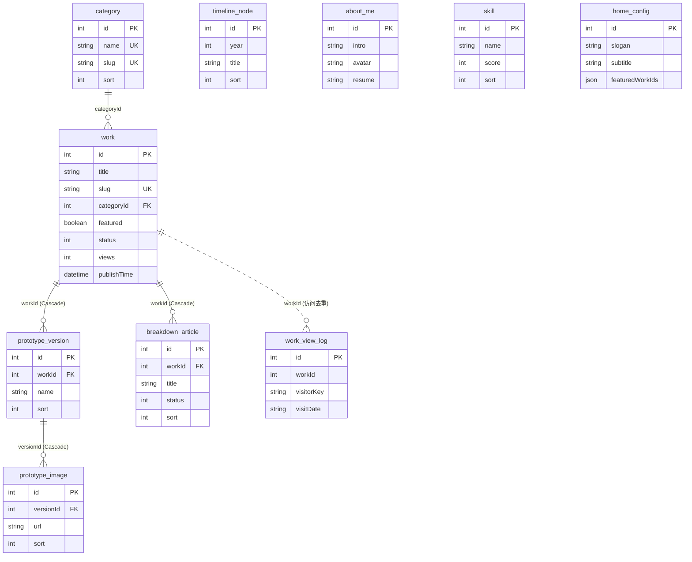

## 一、文档信息

| 项目名称 | 个人作品时光个人作品集系统 |
|---------|-----------|
| 文档版本 | V1.0 |
| 编制日期 | 2026-06-30 |
| 编制人 | 后端工程组 |
| 关联需求文档 | 20260628-个人作品时光个人作品集系统-SRS需求规格说明书-V1.0.md |
| 关联概要设计 | 20260628-个人作品时光个人作品集系统-概要设计说明书-V1.1.md |
| 文档状态 | 草稿 |

**历史版本**

| 版本 | 日期 | 作者 | 更改说明 |
|-----|------|------|---------|
| V1.0 | 2026-06-30 | 后端工程组 | 初始版本，覆盖 Phase 2 全部后端模块（B01/B03/B04/B05/B06/B07） |

---

## 二、引言

### 2.1 编写目的

本文档为「个人作品时光个人作品集系统」后端（Phase 2）的详细设计说明书，面向后端开发工程师，作为编码实现的直接依据。文档在概要设计（HLD）的模块划分基础上，细化到可落地的数据库物理结构、API 接口签名、模块类设计与核心业务流程。

本期覆盖后端模块：B01 身份认证、B03 时间轴管理、B04 关于我管理、B05 作品管理（含原型版本、原型图片、拆解文章、文件上传）、B06 首页配置、B07 数据统计。其中 B02 分类管理已先行实现，B01 身份认证为对已实现接口的反向记录。

### 2.2 设计依据

- 《个人作品时光个人作品集系统-SRS需求规格说明书-V1.0》——业务规则来源
- 《个人作品时光个人作品集系统-概要设计说明书-V1.1》——模块划分与分层
- 管理后台前端 API 契约（`admin/src/api/*.ts`）——接口形态与字段的最重要来源
- 后端工程现状（`server/`，NestJS 11 + Prisma 6 + MySQL）与既有 `category` 模块范本——技术约定来源

### 2.3 全局约定

贯穿所有模块的通用约定，各模块章节不再重复。

**技术栈：** NestJS 11 + TypeScript + Prisma 6 + MySQL 8 + Redis；鉴权 JWT（@nestjs/jwt + passport）；接口文档 Swagger（`/docs`）。

**统一响应格式：** 所有接口返回统一外壳 `{ code, data, message }`，由全局 `TransformInterceptor` 包装、`BaseController.ok()/fail()` 生成：

```typescript
interface ApiResult<T> {
  code: number      // 业务状态码：200 成功，400 业务错误，401 未登录，403 无权限，500 服务器错误
  data: T | null    // 业务数据，失败时为 null
  message: string   // 提示信息，成功为 'success'
}
```

分页数据的 `data` 内层结构为 `{ list: T[], pagination: { page, pageSize, total } }`。不分页列表直接返回数组。

**公共字段：** 所有数据表统一含以下字段（本项目约定，**无** `created_by/updated_by`）：

| 字段 | Prisma 定义 | 说明 |
|------|------------|------|
| `id` | `Int @id @default(autoincrement())` | 主键，自增 |
| `tenantId` | `Int?`（+ `@@index([tenantId])`） | 租户 ID，单管理员模式预留多租户 |
| `createTime` | `DateTime @default(now())` | 创建时间 |
| `updateTime` | `DateTime @updatedAt` | 更新时间 |

**命名规范：**

- Prisma model 用 PascalCase（如 `TimelineNode`），物理表名用 `@@map("snake_case")`（如 `timeline_node`），字段用 camelCase（如 `createTime`，非 `created_at`）
- 字段中文注释用 Prisma 三斜线 `///`，由 `prisma:push` 经 `sync-db-comments.ts` 同步到数据库列注释
- 外键字段（`*Id`）建 `@@index`；唯一约束用 `@unique` / 复合 `@@unique([a, b])`
- 路由前缀：管理后台 `admin/*`，展示端 `app/*`（本期展示端鉴权占位放行）

**日期格式：** 实体 `DateTime` 在 Service 层转 `toISOString()`，由全局 `TransformInterceptor` 统一格式化为东八区 `YYYY-MM-DD HH:mm:ss`；VO 中日期字段类型声明为 `string`。

**错误码与异常：**

- 业务校验失败在 Service 抛 `BadRequestException('中文提示')`（HTTP 400）或 Controller 返回 `this.fail('提示')`
- Prisma 已知错误由全局 `AllExceptionsFilter` 兜底转译：P2002（唯一冲突）、P2025（记录不存在）、P2003（外键约束）统一转 400 + 友好提示，不泄露内部细节
- 模块内对 P2002/P2025 做语义化提示（如「唯一标识已存在，请更换」）

**鉴权约定：**

- 全局注册 `AuthGuard`（JWT 验签 + Redis token 比对 + 密码版本校验）+ `PermsGuard`（声明式 RBAC）
- 免登录接口加 `@Public()`；其余默认需登录
- 权限点声明用 `@Perms('action')`，完整权限点 = controller 前缀去 `admin/` 后斜杠转冒号 + `:action`（如 `admin/work` + `add` → `work:add`）
- 超级管理员（username = `admin`）放行全部权限校验
- 新增接口的权限点由 `PermsSyncService` 在启动时扫描 `@Perms` 自动登记为菜单按钮节点

**通用错误码：**

| HTTP | code | message | 场景 |
|------|------|---------|------|
| 400 | 400 | 具体业务提示 | 参数校验/业务规则失败 |
| 401 | 401 | 登录失效~ | 未登录或 Token 失效 |
| 403 | 403 | 无权限访问~ | 权限不足 |
| 500 | 500 | 服务器内部错误 | 系统异常 |

---

## 三、模块详细设计

### 3.1 B01 身份认证 详细设计

**模块职责：** 管理员账号密码登录、JWT 双 token（access/refresh）签发与刷新、登出清理、按角色汇聚权限标识与过滤菜单树。对应 HLD 身份认证模块，SRS 3.2#1 / 3.4。本模块为对既有实现（`base` 模块 `OpenController` + `AuthService`）的反向记录，不新建表与文件。

**核心类/服务设计：**

| 类/服务名 | 职责 | 关键方法 |
|----------|------|---------|
| OpenController（`admin/open`） | 接收登录/刷新/登出/查询请求 | login / refreshToken / logout / person / perms / permmenu / health |
| AuthService | 登录校验、token 签发、权限汇聚 | login / refresh / logout / getPerms / getMenuTree |
| AuthGuard（全局） | JWT 验签 + Redis 比对 + 密码版本校验 | canActivate |
| PermsGuard（全局） | 声明式 RBAC 权限校验 | canActivate |

**Redis 缓存键约定：**

| Key | 值 | TTL |
|-----|----|----|
| `admin:token:{userId}` | access token | JWT_ACCESS_EXPIRE（默认 7200s） |
| `admin:refreshToken:{userId}` | refresh token | JWT_REFRESH_EXPIRE（默认 1296000s） |
| `admin:passwordVersion:{userId}` | passwordV | 同 refresh |
| `admin:perms:{userId}` | 权限标识 JSON 数组 | 同 access |

**核心业务流程 — 登录：**

1. 按 username 查 `SysUser`，不存在 → `BadRequestException('用户名或密码错误')`
2. `bcrypt.compare` 校验密码，失败 → 同上提示（不区分用户名/密码错误，防枚举）
3. 校验 `status === 1`，禁用 → `BadRequestException('用户已被禁用')`
4. 签发 access token（payload：userId/username/roleIds/passwordVersion）与 refresh token（含 isRefresh 标记）
5. 写入 Redis（token / refreshToken / passwordVersion），预热 perms 缓存
6. 返回 `{ token, refreshToken, expire }`

**核心业务流程 — 刷新 token：**

1. verify refresh token，失败 → `UnauthorizedException('登录失效~')`
2. 校验 `payload.isRefresh === true`，否则拒绝（access token 不能用于刷新）
3. 与 Redis 留存 refresh token 比对一致
4. 校验 `passwordVersion` 与 Redis 一致（改密后旧 token 失效）
5. 签发新 access token，更新 Redis，返回 `{ token, expire }`

**异常处理：**

| 异常场景 | 处理策略 | 错误反馈 |
|---------|---------|---------|
| 用户不存在/密码错误 | 拒绝登录 | 400 用户名或密码错误 |
| 账号已禁用 | 拒绝登录 | 400 用户已被禁用 |
| token 失效/验签失败 | 拒绝访问 | 401 登录失效~ |
| 改密后旧 token | 刷新/访问时拒绝 | 401 登录失效~ |

---

### 3.2 B03 时间轴管理 详细设计

**模块职责：** 维护成长轨迹年份节点（新增/编辑/删除/排序），无草稿状态、保存即公开。对应 SRS 3.5.3。模块路径 `src/modules/timeline/`，参照 `category` 五件套，与作品、分类无关联。

**核心类/服务设计：**

| 类/服务名 | 职责 | 关键方法 |
|----------|------|---------|
| TimelineController（`admin/timeline`） | 接收请求、参数校验 | list / add / update / delete |
| TimelineService（extends BaseService） | 列表查询、增改删、错误转译 | getList / addNode / updateNode / deleteNode |

**核心业务流程 — 列表查询：** `prisma.timelineNode.findMany({ orderBy: [{ sort: 'asc' }, { year: 'asc' }] })`，排序值相同按年份升序，转 VO 数组返回。

**异常处理：**

| 异常场景 | 处理策略 | 错误反馈 |
|---------|---------|---------|
| year 非 4 位年份 | 拒绝 | 400 请输入有效的年份（如 2024） |
| title 为空 | 拒绝 | 400 标题不能为空 |
| 更新/删除目标不存在 | 中止（P2025） | 400 时间轴节点不存在或已被删除 |

---

### 3.3 B04 关于我管理 详细设计

**模块职责：** 维护个人介绍（`AboutMe` 单条覆盖写入：简介/头像/简历）与技能列表（`Skill` 多条 CRUD + 排序）。对应 SRS 3.5.4。模块路径 `src/modules/about/`。

**核心类/服务设计：**

| 类/服务名 | 职责 | 关键方法 |
|----------|------|---------|
| AboutController（`admin/about`） | 接收个人介绍/技能请求 | getProfile / updateProfile / skillList / addSkill / updateSkill / deleteSkill |
| AboutService | 个人介绍 upsert、技能增改删 | getProfile / upsertProfile / getSkillList / addSkill / updateSkill / deleteSkill |

**核心业务流程 — 个人介绍覆盖写入：** `prisma.aboutMe.upsert({ where: { id: 1 }, create: { id: 1, ...dto }, update: { ...dto } })`，保证表内最多一条；首次读取无记录时返回 `{ intro: '', avatar: null, resume: null }`，不报 404。

**异常处理：**

| 异常场景 | 处理策略 | 错误反馈 |
|---------|---------|---------|
| intro 为空 | 拒绝 | 400 个人简介不能为空 |
| score 超出 0-100 | 拒绝 | 400 评分值须在 0 到 100 之间 |
| 技能更新/删除不存在 | 中止（P2025） | 400 技能不存在或已被删除 |

---

### 3.4 B05 作品管理 详细设计

**模块职责：** 系统数据核心，以作品为中心聚合管理作品、原型版本、原型图片、拆解文章，含发布/下架/精选状态控制与级联删除。对应 SRS 3.5.1。模块路径 `src/modules/work/`，依赖 `CategoryModule`（校验 categoryId 与拼接 categoryName）。

**核心类/服务设计：**

| 类/服务名 | 职责 | 关键方法 |
|----------|------|---------|
| WorkController（`admin/work`） | 作品 CRUD + 状态/精选切换 | list / add / update / delete / toggleStatus / toggleFeatured |
| VersionController（`admin/work/version`） | 原型版本 CRUD | list / add / update / delete |
| ImageController（`admin/work/image`） | 原型图片管理（批量） | list / add / update / delete |
| ArticleController（`admin/work/article`） | 拆解文章 CRUD + 状态切换 | list / add / update / delete / toggleStatus |
| WorkService | 作品业务、级联删除、状态机、categoryName 拼接 | 各业务方法 |
| VersionService / ImageService / ArticleService | 子资源业务逻辑 | 各业务方法 |

**核心业务流程 — 作品发布/下架（toggle-status）：**

1. 按 id 查当前作品，不存在 → 400 作品不存在
2. 计算新状态：`newStatus = current.status === 1 ? 0 : 1`
3. 判断首次发布：`isFirstPublish = current.publishTime === null && newStatus === 1`
4. update：写入 `status: newStatus`，若首次发布则同时写 `publishTime: new Date()`（后续发布不覆盖）
5. 返回更新后 VO

**核心业务流程 — 作品删除（级联）：** Schema 已设两层 `onDelete: Cascade`（Work→PrototypeVersion→PrototypeImage；Work→BreakdownArticle），由数据库层级联清理。Service 直接 `prisma.work.delete({ where: { id } })`，P2025 转「作品不存在或已被删除」。

**核心业务流程 — 批量新增原型图片：** 校验 versionId 存在 → `prisma.prototypeImage.createMany({ data: images.map(...) })` → 查询回写入记录返回 VO 数组。

**状态机（作品 / 拆解文章 status）：**

初始状态由新增时 `status` 入参决定（默认 0 草稿）；若新增时直接传 `status=1`，视同首次发布，同步写入 `publishTime`。后续状态切换经 `toggle-status`：

| 当前状态 | 触发条件 | 流转至 | 系统动作 |
|---------|---------|-------|---------|
| 草稿(0) | toggle-status | 已发布(1) | 首次发布记录 publishTime；展示端可见 |
| 已发布(1) | toggle-status | 草稿(0) | 不清除 publishTime；展示端移除 |

精选标记（featured）：`toggle-featured` 读当前值取反 update，无其他副作用。

**异常处理：**

| 异常场景 | 处理策略 | 错误反馈 |
|---------|---------|---------|
| slug 格式非法 | 拒绝 | 400 唯一标识仅允许英文字母、数字和连字符 |
| slug 全局冲突 | 中止（P2002） | 400 唯一标识已存在，请更换 |
| 版本名同作品下冲突 | 中止（P2002） | 400 该版本名已存在，请更换 |
| categoryId 不存在 | 前置校验拦截 | 400 所选分类不存在 |
| 子资源父级不存在 | 中止 | 400 关联的作品/版本不存在 |

---

### 3.5 B06 首页配置 详细设计

**模块职责：** 管理展示站点首页文案（slogan/subtitle）与精选作品 ID 列表（单条覆盖写入），提供精选作品候选池查询。对应 SRS 3.5.5。模块路径 `src/modules/home-config/`，依赖 `WorkModule`（候选池查询与 ID 有效性校验）。

**核心类/服务设计：**

| 类/服务名 | 职责 | 关键方法 |
|----------|------|---------|
| HomeConfigController（`admin/home-config`） | 配置读写、候选池查询 | getConfig / updateConfig / getFeaturedOptions |
| HomeConfigService | upsert 覆盖、精选 ID 校验、候选池查询 | getConfig / upsertConfig / getFeaturedOptions |

**核心业务流程 — 配置覆盖写入：**

1. 校验 slogan 非空且 ≤50 字（DTO 层）
2. 校验 featuredWorkIds 中每个 ID 对应作品存在且 `status=1 且 featured=true`，无效 → 400 存在无效的精选作品 ID，请刷新候选池后重试
3. `prisma.homeConfig.upsert({ where: { id: 1 }, create: { id: 1, ...dto }, update: { ...dto } })`
4. 返回更新后 VO

**核心业务流程 — 精选候选池：** 查 `Work` 表 `where: { status: 1, featured: true }`，按 `sort asc, createTime asc` 排序，拼接 categoryName 返回 `{ id, title, categoryName }[]`。

---

### 3.6 B07 数据统计 详细设计

**模块职责：** 后台只读查看作品访问量排行（仅已发布作品，按访问量降序分页）。对应 SRS 3.5.6。模块路径 `src/modules/statistics/`，直接注入 `PrismaService` 查询（避免循环依赖）。访问量累加与去重（`WorkViewLog` 表 + `Work.views`）归属作品访问域，由展示端 `app` 接口写入，B07 仅读取冗余字段。

**核心类/服务设计：**

| 类/服务名 | 职责 | 关键方法 |
|----------|------|---------|
| StatisticsController（`admin/statistics`） | 访问量排行查询 | getWorkViewRank |
| StatisticsService | 已发布作品分页排行查询 | getWorkViewRank |

**核心业务流程 — 访问量排行：** `prisma.work.findMany({ where: { status: 1 }, include: { category: { select: { name: true } } }, orderBy: [{ views: 'desc' }, { publishTime: 'desc' }], skip, take })` + `count`，分类名空值返回 `'-'`，组装分页结果。

**访问量去重机制（说明，写入实现属展示端）：** 访客访问作品详情时，以 `visitorKey = sha256(ip + ':' + userAgent).slice(0,32)` 为来源指纹，`visitDate` 为 UTC 自然日，借 `work_view_log` 表的 `@@unique([workId, visitorKey, visitDate])` 唯一约束实现同源 24 小时（自然日）去重：写入成功则 `Work.views` 原子 `increment(1)`，捕获 P2002 则跳过累加。

**展示端访问量写入（占位，本期后续展示端实现）：** 累加写入入口归属展示端作品模块（计划路径 `app/work`），触发时机为展示端作品详情 `GET /app/work/detail/:slug` 请求；写入逻辑：生成 visitorKey/visitDate → 尝试 `prisma.workViewLog.create` → 成功则 `prisma.work.update({ data: { views: { increment: 1 } } })`，P2002 跳过。该接口的完整设计待展示端后端（与展示站点联调阶段）补充，本 LLD 仅锚定其与 `work_view_log`（见 4.3.5）的关系与归属，B07 后台统计仅只读消费 `Work.views`。

---

## 四、数据库物理设计

### 4.1 物理实体关系图



### 4.2 数据表清单

本期后端涉及 10 张表（`category` 已建，其余 9 张本期新建/扩展）。

| 序号 | 表名（@@map） | Prisma Model | 业务含义 | 所属模块 |
|-----|--------------|-------------|---------|---------|
| 1 | category | Category | 作品分类 | B02（已建，本期补反向关系） |
| 2 | work | Work | 作品主表 | B05 |
| 3 | prototype_version | PrototypeVersion | 原型版本 | B05 |
| 4 | prototype_image | PrototypeImage | 原型图片 | B05 |
| 5 | breakdown_article | BreakdownArticle | 拆解文章 | B05 |
| 6 | work_view_log | WorkViewLog | 作品访问去重日志 | B05（B07 读 Work.views） |
| 7 | timeline_node | TimelineNode | 时间轴节点 | B03 |
| 8 | about_me | AboutMe | 个人介绍（单条） | B04 |
| 9 | skill | Skill | 技能 | B04 |
| 10 | home_config | HomeConfig | 首页配置（单条） | B06 |

> B01 身份认证复用既有 `base_sys_user` / `base_sys_role` / `base_sys_menu` / `base_sys_user_role` / `base_sys_role_menu`，本期不改动。

### 4.3 表结构详细设计

> 公共字段（`tenantId Int?` + `createTime` + `updateTime`）所有表统一携带，下方表仅列业务字段与公共字段中需强调者。所有表 `ENGINE=InnoDB DEFAULT CHARSET=utf8mb4`。

#### 4.3.1 work（作品主表）

| 字段 | 类型 | 允许空 | 键 | 默认 | 说明 |
|------|------|-------|----|------|------|
| id | INT AUTO_INCREMENT | 否 | PK | - | 主键 |
| title | VARCHAR(100) | 否 | - | - | 作品标题 |
| slug | VARCHAR(100) | 否 | UK | - | URL 唯一标识，仅小写字母数字连字符 |
| intro | VARCHAR(500) | 是 | - | NULL | 简介 |
| cover | VARCHAR(500) | 是 | - | NULL | 封面图 URL |
| detail | TEXT | 是 | - | NULL | 富文本详情 |
| categoryId | INT | 否 | FK | - | 所属分类 |
| featured | TINYINT(1) | 否 | - | 0 | 精选标记：0 否 1 是 |
| status | TINYINT | 否 | - | 0 | 发布状态：0 草稿 1 已发布 |
| views | INT | 否 | - | 0 | 累计访问量（展示端累加，后台只读） |
| sort | INT | 是 | - | NULL | 排序值，越小越靠前，NULL 排后 |
| publishTime | DATETIME | 是 | - | NULL | 首次发布时间，后续不覆盖 |
| tenantId | INT | 是 | - | NULL | 租户 ID |
| createTime | DATETIME | 否 | - | CURRENT_TIMESTAMP | 创建时间 |
| updateTime | DATETIME | 否 | - | ON UPDATE | 更新时间 |

**索引：** PRIMARY(id)；`uk_work_slug`(slug) 唯一；`idx_work_categoryId`(categoryId)；`idx_work_status`(status)；`idx_work_tenantId`(tenantId)

**关系：** `fk_work_category`：categoryId → category.id（N:1）

#### 4.3.2 prototype_version（原型版本）

| 字段 | 类型 | 允许空 | 键 | 默认 | 说明 |
|------|------|-------|----|------|------|
| id | INT AUTO_INCREMENT | 否 | PK | - | 主键 |
| workId | INT | 否 | FK | - | 所属作品 |
| name | VARCHAR(20) | 否 | - | - | 版本名，同作品下唯一 |
| title | VARCHAR(100) | 是 | - | NULL | 版本说明 |
| sort | INT | 是 | - | NULL | 排序值 |

**索引：** PRIMARY(id)；`uk_prototype_version_work_name`(workId, name) 唯一；`idx_prototype_version_workId`(workId)；`idx_prototype_version_tenantId`(tenantId)

**关系：** `fk_prototype_version_work`：workId → work.id，**ON DELETE CASCADE**

#### 4.3.3 prototype_image（原型图片）

| 字段 | 类型 | 允许空 | 键 | 默认 | 说明 |
|------|------|-------|----|------|------|
| id | INT AUTO_INCREMENT | 否 | PK | - | 主键 |
| versionId | INT | 否 | FK | - | 所属版本 |
| url | VARCHAR(500) | 否 | - | - | 图片 URL |
| caption | VARCHAR(200) | 是 | - | NULL | 图片说明 |
| sort | INT | 是 | - | NULL | 排序值 |

**索引：** PRIMARY(id)；`idx_prototype_image_versionId`(versionId)；`idx_prototype_image_tenantId`(tenantId)

**关系：** `fk_prototype_image_version`：versionId → prototype_version.id，**ON DELETE CASCADE**

#### 4.3.4 breakdown_article（拆解文章）

| 字段 | 类型 | 允许空 | 键 | 默认 | 说明 |
|------|------|-------|----|------|------|
| id | INT AUTO_INCREMENT | 否 | PK | - | 主键 |
| workId | INT | 否 | FK | - | 所属作品 |
| title | VARCHAR(100) | 否 | - | - | 文章标题 |
| content | TEXT | 是 | - | NULL | 富文本正文 |
| status | TINYINT | 否 | - | 0 | 发布状态：0 草稿 1 已发布 |
| sort | INT | 是 | - | NULL | 排序值 |

**索引：** PRIMARY(id)；`idx_breakdown_article_workId`(workId)；`idx_breakdown_article_tenantId`(tenantId)

**关系：** `fk_breakdown_article_work`：workId → work.id，**ON DELETE CASCADE**

#### 4.3.5 work_view_log（作品访问去重日志）

| 字段 | 类型 | 允许空 | 键 | 默认 | 说明 |
|------|------|-------|----|------|------|
| id | INT AUTO_INCREMENT | 否 | PK | - | 主键 |
| workId | INT | 否 | - | - | 作品 ID |
| visitorKey | VARCHAR(64) | 否 | - | - | 访客指纹 sha256(ip:ua) 前 32 位 |
| visitDate | VARCHAR(10) | 否 | - | - | 访问日期 YYYY-MM-DD（UTC 自然日） |
| tenantId | INT | 是 | - | NULL | 租户 ID |

**索引：** PRIMARY(id)；`uk_work_view_log_unique`(workId, visitorKey, visitDate) 唯一；`idx_work_view_log_workId`(workId)；`idx_work_view_log_tenantId`(tenantId)

**关系：** 不设数据库外键约束（workId 为逻辑关联）。作品删除时本表日志不随级联清理，由后续运维定时任务清理孤儿日志；`Work.views` 为冗余计数，删除作品即随作品消失，不依赖日志表。`visitDate` 选用 `VARCHAR(10)` 而非 `DATE`，避免 Prisma `DateTime` 时区反序列化影响唯一约束匹配。

**说明：** 不存原始 IP，仅存哈希指纹（脱敏）；唯一约束实现同源自然日去重，并发由约束兜底（捕获 P2002 跳过累加）。

#### 4.3.6 timeline_node（时间轴节点）

| 字段 | 类型 | 允许空 | 键 | 默认 | 说明 |
|------|------|-------|----|------|------|
| id | INT AUTO_INCREMENT | 否 | PK | - | 主键 |
| year | INT | 否 | - | - | 年份（4 位公历，1000-9999） |
| title | VARCHAR(100) | 否 | - | - | 节点标题 |
| description | VARCHAR(500) | 是 | - | NULL | 描述 |
| sort | INT | 否 | - | 0 | 排序值 |

**索引：** PRIMARY(id)；`idx_timeline_node_sort_year`(sort, year) 排序复合索引；`idx_timeline_node_tenantId`(tenantId)

**说明：** 同年份允许存在多条节点（SRS 未限制年份唯一），故不建年份唯一约束。

#### 4.3.7 about_me（个人介绍，单条）

| 字段 | 类型 | 允许空 | 键 | 默认 | 说明 |
|------|------|-------|----|------|------|
| id | INT AUTO_INCREMENT | 否 | PK | - | 主键（固定 id=1） |
| intro | VARCHAR(500) | 否 | - | - | 个人简介 |
| avatar | VARCHAR(500) | 是 | - | NULL | 头像 URL |
| resume | TEXT | 是 | - | NULL | 简历富文本 HTML |

**索引：** PRIMARY(id)；`idx_about_me_tenantId`(tenantId)

#### 4.3.8 skill（技能）

| 字段 | 类型 | 允许空 | 键 | 默认 | 说明 |
|------|------|-------|----|------|------|
| id | INT AUTO_INCREMENT | 否 | PK | - | 主键 |
| name | VARCHAR(100) | 否 | - | - | 技能名称 |
| score | INT | 否 | - | - | 评分值（0-100） |
| sort | INT | 否 | - | 0 | 排序值 |

**索引：** PRIMARY(id)；`idx_skill_tenantId`(tenantId)

#### 4.3.9 home_config（首页配置，单条）

| 字段 | 类型 | 允许空 | 键 | 默认 | 说明 |
|------|------|-------|----|------|------|
| id | INT AUTO_INCREMENT | 否 | PK | - | 主键（固定 id=1） |
| slogan | VARCHAR(50) | 否 | - | - | 展示标语（1-50 字） |
| subtitle | VARCHAR(100) | 是 | - | NULL | 副标题（0-100 字） |
| featuredWorkIds | JSON | 否 | - | [] | 精选作品 ID 数组，保留顺序 |

**索引：** PRIMARY(id)；`idx_home_config_tenantId`(tenantId)

#### 4.3.10 category（作品分类，已建，本期扩展）

本期为 `Category` model 补充反向关系 `works Work[]`（不改物理结构）。现有字段：id / name(唯一) / slug(唯一) / sort / tenantId / createTime / updateTime。

### 4.4 数据字典（枚举）

| 枚举类型 | 值 | 说明 |
|---------|----|----|
| work.status / breakdown_article.status | 0 | 草稿 |
| ^ | 1 | 已发布 |
| work.featured | 0 / false | 非精选 |
| ^ | 1 / true | 精选 |

---

## 五、API 详细设计

### 5.1 通用规范

统一响应外壳与分页结构见 2.3 全局约定。本项目响应外壳为 `{ code, data, message }`（code=200 成功），列表分页 data 内层为 `{ list, pagination: { page, pageSize, total } }`，不分页列表 data 直接为数组。所有 `/admin/*` 接口默认需登录鉴权，权限点由 `@Perms(action)` + controller 前缀派生。

### 5.2 接口清单

| # | 方法 | 路径 | 用途 | 鉴权/权限点 | 模块 |
|---|------|------|------|-----------|------|
| 1 | POST | /admin/open/login | 登录 | @Public | B01 |
| 2 | POST | /admin/open/refreshToken | 刷新 token | @Public | B01 |
| 3 | POST | /admin/open/logout | 登出 | 登录 | B01 |
| 4 | GET | /admin/open/person | 当前用户信息 | 登录 | B01 |
| 5 | GET | /admin/open/perms | 权限标识列表 | 登录 | B01 |
| 6 | GET | /admin/open/permmenu | 菜单树 | 登录 | B01 |
| 7 | GET | /admin/timeline/list | 时间轴列表 | timeline:list | B03 |
| 8 | POST | /admin/timeline/add | 新增节点 | timeline:add | B03 |
| 9 | PUT | /admin/timeline/update | 更新节点 | timeline:update | B03 |
| 10 | DELETE | /admin/timeline/delete/:id | 删除节点 | timeline:delete | B03 |
| 11 | GET | /admin/about/profile | 获取个人介绍 | 登录 | B04 |
| 12 | PUT | /admin/about/profile | 更新个人介绍 | about:profile-update | B04 |
| 13 | GET | /admin/about/skill/list | 技能列表 | about:skill-list | B04 |
| 14 | POST | /admin/about/skill/add | 新增技能 | about:skill-add | B04 |
| 15 | PUT | /admin/about/skill/update | 更新技能 | about:skill-update | B04 |
| 16 | DELETE | /admin/about/skill/delete/:id | 删除技能 | about:skill-delete | B04 |
| 17 | GET | /admin/work/list | 作品列表 | work:list | B05 |
| 18 | POST | /admin/work/add | 新增作品 | work:add | B05 |
| 19 | PUT | /admin/work/update | 更新作品 | work:update | B05 |
| 20 | DELETE | /admin/work/delete/:id | 删除作品（级联） | work:delete | B05 |
| 21 | PUT | /admin/work/toggle-status | 发布/下架 | work:toggle-status | B05 |
| 22 | PUT | /admin/work/toggle-featured | 切换精选 | work:toggle-featured | B05 |
| 23 | GET | /admin/work/version/list | 版本列表 | work:version:list | B05 |
| 24 | POST | /admin/work/version/add | 新增版本 | work:version:add | B05 |
| 25 | PUT | /admin/work/version/update | 更新版本 | work:version:update | B05 |
| 26 | DELETE | /admin/work/version/delete/:id | 删除版本（级联图片） | work:version:delete | B05 |
| 27 | GET | /admin/work/image/list | 图片列表 | work:image:list | B05 |
| 28 | POST | /admin/work/image/add | 批量新增图片 | work:image:add | B05 |
| 29 | PUT | /admin/work/image/update | 更新图片 | work:image:update | B05 |
| 30 | DELETE | /admin/work/image/delete/:id | 删除图片 | work:image:delete | B05 |
| 31 | GET | /admin/work/article/list | 文章列表 | work:article:list | B05 |
| 32 | POST | /admin/work/article/add | 新增文章 | work:article:add | B05 |
| 33 | PUT | /admin/work/article/update | 更新文章 | work:article:update | B05 |
| 34 | DELETE | /admin/work/article/delete/:id | 删除文章 | work:article:delete | B05 |
| 35 | PUT | /admin/work/article/toggle-status | 文章发布/下架 | work:article:toggle-status | B05 |
| 36 | POST | /admin/space/info/upload | 文件上传（复用） | space:info:upload | B05 |
| 37 | GET | /admin/home-config | 获取首页配置 | home-config:get | B06 |
| 38 | PUT | /admin/home-config | 更新首页配置 | home-config:update | B06 |
| 39 | GET | /admin/home-config/featured-options | 精选候选池 | home-config:featured-options | B06 |
| 40 | GET | /admin/statistics/work-views | 访问量排行 | statistics:work-views | B07 |

> **关于 GET /admin/about/profile 与 GET /admin/home-config 的鉴权：** 两个读接口标为「仅需登录」（不声明 `@Perms` 权限点）是有意设计——它们是后台编辑页进入时的数据回显读取，无独立菜单入口、不需要按钮级权限管控；其写操作（PUT）声明了权限点。单管理员模式下超管放行全部权限，此设计不影响安全性。
> **作品列表不分页（GET /admin/work/list 返回数组）** 为有意设计：管理后台作品量预期有限（建议上限 500 条），超出后再引入分页。展示端列表与统计排行接口均分页。

### 5.3 接口详细设计（关键接口）

> 标准 CRUD 接口请求/响应遵循统一约定，下方仅展开含业务逻辑的关键接口；其余接口字段见对应模块 DTO/VO 定义（5.4）。

#### 5.3.1 新增作品 — POST /admin/work/add

- **用途：** 创建作品。**鉴权：** 需登录，`work:add`
- **请求参数（body）：** title(必填,≤100)、slug(必填,≤100,正则 `^[a-z0-9]+(?:-[a-z0-9]+)*$`)、categoryId(必填,整数)、intro(选填,≤500)、cover(选填,≤500)、detail(选填,富文本)、featured(选填,bool,默认false)、status(选填,0/1,默认0)、sort(选填,≥0)
- **处理：** 校验 categoryId 存在 → create（publishTime 不在此设；若 status=1 则同时记 publishTime）→ 返回 WorkVo
- **错误码：** 400 唯一标识已存在/格式非法/所选分类不存在
- **事务/幂等：** slug 唯一约束保证幂等防重

#### 5.3.2 发布/下架 — PUT /admin/work/toggle-status

- **用途：** 切换作品发布状态。**鉴权：** 需登录，`work:toggle-status`
- **请求参数（body）：** `{ id: number }`
- **处理：** 见 3.4 状态机流程（首次发布记 publishTime，后续不覆盖）
- **错误码：** 400 作品不存在

#### 5.3.3 批量新增原型图片 — POST /admin/work/image/add

- **用途：** 为指定版本批量添加图片。**鉴权：** 需登录，`work:image:add`
- **请求参数（body）：** `{ versionId: number, images: { url: string(必填,≤500), caption?: string(≤200), sort?: number(≥0) }[] }`
- **处理：** 校验 versionId 存在 → createMany → 返回新增 PrototypeImageVo[]
- **错误码：** 400 关联的版本不存在

#### 5.3.4 更新首页配置 — PUT /admin/home-config

- **用途：** 覆盖写入首页配置。**鉴权：** 需登录，`home-config:update`
- **请求参数（body）：** slogan(必填,1-50)、subtitle(选填,≤100)、featuredWorkIds(整数数组,去重)
- **处理：** 校验精选 ID 均为已发布+精选作品 → upsert(id=1) → 返回 HomeConfigVo
- **错误码：** 400 展示标语不能为空 / 存在无效的精选作品 ID，请刷新候选池后重试

#### 5.3.5 访问量排行 — GET /admin/statistics/work-views

- **用途：** 分页查询已发布作品访问量排行。**鉴权：** 需登录，`statistics:work-views`
- **请求参数（query）：** page(选填,≥1,默认1)、pageSize(选填,1-100,默认10)
- **处理：** where status=1，orderBy views desc, publishTime desc，LEFT JOIN category 取 name（空值 '-'），分页返回 `{ list:[{id,title,categoryName,views}], pagination }`

### 5.4 DTO / VO 字段定义索引

各模块请求 DTO 与响应 VO 字段定义如下（class-validator 校验规则见括注）：

- **B03 Timeline：** AddTimelineDto(year[1000-9999]/title[≤100]/description?[≤500]/sort[≥0])；UpdateTimelineDto(id + 同上可选)；TimelineNodeVo(id/year/title/description/sort/createTime)
- **B04 About：** UpdateAboutProfileDto(intro[必填]/avatar?/resume?)；AddSkillDto(name[≤100]/score[0-100]/sort[≥0])；UpdateSkillDto(id + 可选)；AboutProfileVo(intro/avatar/resume)；SkillVo(id/name/score/sort/createTime)
- **B05 Work：** WorkListDto(title?/categoryId?/status?)；AddWorkDto/UpdateWorkDto（见 5.3.1）；WorkVo(id/title/slug/intro/cover/detail/categoryId/categoryName/featured/status/views/sort/publishTime/createTime)
- **B05 Version：** AddVersionDto(workId/name[≤20]/title?[≤100]/sort?)；UpdateVersionDto(id + 可选)；PrototypeVersionVo(id/workId/name/title/sort/createTime)
- **B05 Image：** AddImagesDto(versionId/images[])；UpdateImageDto(id/caption?/sort?)；PrototypeImageVo(id/versionId/url/caption/sort/createTime)
- **B05 Article：** AddArticleDto(workId/title[≤100]/content?/status?/sort?)；UpdateArticleDto(id + 可选)；BreakdownArticleVo(id/workId/title/content/status/sort/createTime)
- **B06 HomeConfig：** UpdateHomeConfigDto(slogan[1-50]/subtitle?[≤100]/featuredWorkIds[])；HomeConfigVo(slogan/subtitle/featuredWorkIds)；FeaturedWorkOptionVo(id/title/categoryName)
- **B07 Statistics：** WorkViewRankDto(page?/pageSize?)；WorkViewRankItemVo(id/title/categoryName/views)；WorkViewRankResultVo(list/pagination)

> 所有 VO 均排除 `tenantId` 与 `updateTime`（脱敏）；categoryName 为关联查询拼接字段，非实体列。

---

## 六、安全设计

| 安全维度 | 设计 |
|---------|------|
| 鉴权 | JWT 双 token（access/refresh），全局 `AuthGuard` 验签 + Redis token 比对 + 密码版本校验；refresh token 不能访问业务接口；改密后 passwordV 自增使旧 token 立即失效 |
| 权限控制 | 声明式 RBAC：`@Perms(action)` + controller 前缀派生权限点，`PermsGuard` 比对用户权限（Redis 缓存）；超管放行；启动时 `PermsSyncService` 自动登记权限点为菜单按钮 |
| 输入校验 | 全局 `ValidationPipe`（whitelist + forbidNonWhitelisted + transform），DTO 用 class-validator 白名单校验；slug 正则约束；query 参数显式声明类型 |
| 防注入 | 统一经 Prisma 参数化查询，禁裸 SQL；外部输入（URL 参数、body）使用前校验 |
| 敏感数据 | 密码 bcrypt(cost=12) 哈希存储，`password/passwordV/socketId` 不进任何 VO；访问日志仅存 sha256 指纹不存原始 IP；上传目录设 `X-Content-Type-Options: nosniff` 防 MIME 嗅探 XSS |
| 草稿隔离 | 展示端（`app/*`）查询作品与拆解文章时统一加 `status=1` 过滤，草稿内容（含草稿作品、草稿拆解文章）不对访客返回；后台接口需登录方可见草稿 |
| 文件上传 | 复用 space 上传，限制 body 10mb；生产建议网关层（Nginx client_max_body_size）再设兜底；上传文件经静态目录服务 |
| 级联删除 | 作品/版本删除经数据库外键 `ON DELETE CASCADE` 原子级联，避免应用层遗漏导致孤儿数据 |

---

## 七、可追溯矩阵

| 设计要素 | 类型 | 追溯来源（SRS / HLD） |
|---------|------|---------------------|
| base_sys_* 复用 + /admin/open/* | 表+接口 | 身份认证 / SRS 3.2#1、3.4 |
| timeline_node + /admin/timeline/* | 表+接口 | 时间轴管理 / SRS 3.5.3 |
| about_me + skill + /admin/about/* | 表+接口 | 关于我管理 / SRS 3.5.4 |
| work + /admin/work/*（含 toggle-status/featured） | 表+接口 | 作品管理 / SRS 3.5.1.1 |
| prototype_version + prototype_image + /admin/work/version、image/* | 表+接口 | 原型版本 / SRS 3.5.1.2 |
| breakdown_article + /admin/work/article/* | 表+接口 | 拆解文章 / SRS 3.5.1.3 |
| /admin/space/info/upload（复用 space 模块） | 接口 | 文件上传 / SRS 3.5.1（作品封面、原型图片上传） |
| work_view_log + Work.views 去重累加 | 表+机制 | 作品访问统计 / SRS 3.5.6、3.5.1（访问量去重） |
| home_config + /admin/home-config/* | 表+接口 | 首页配置 / SRS 3.5.5 |
| /admin/statistics/work-views | 接口 | 数据统计 / SRS 3.5.6 |
| 草稿隔离（status=1 过滤） | 机制 | SRS 3.5.1.1、3.4（展示端仅已发布可见） |
| 级联删除（onDelete Cascade） | 机制 | SRS 3.5.1（作品删除级联清子资源） |
| 首次发布时间记录 | 机制 | SRS 3.5.1.1（首次发布记 publishTime 不覆盖） |

---

**文档结束。** 本 LLD 作为 Phase 2 后端 `backend-generator` 的实现依据，所有表、接口、字段均可追溯至 SRS 功能与前端契约。


